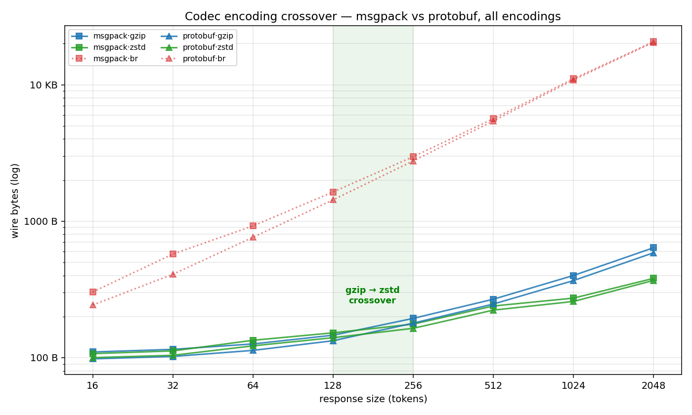
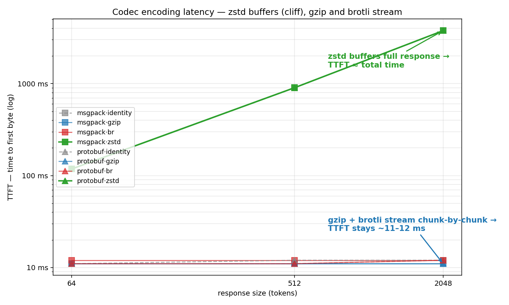
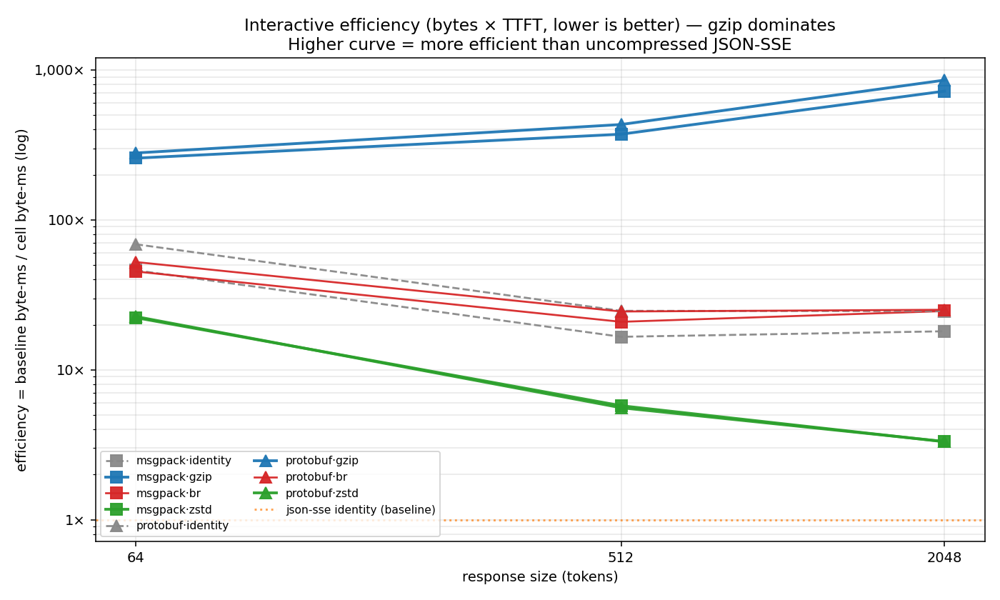
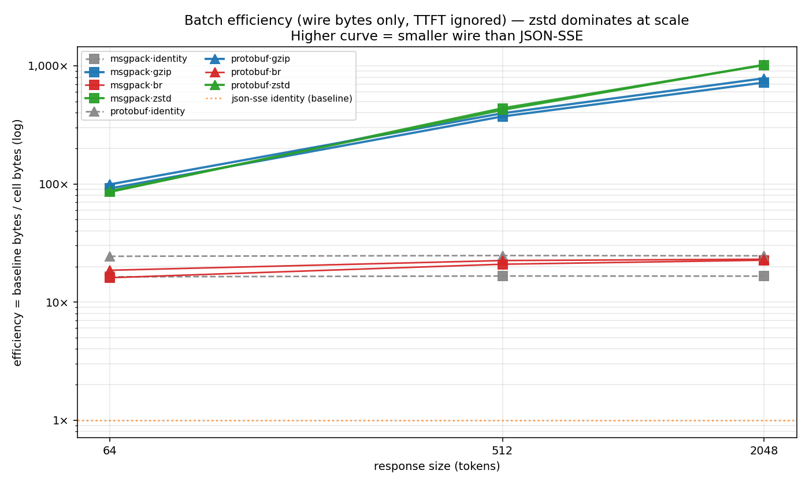
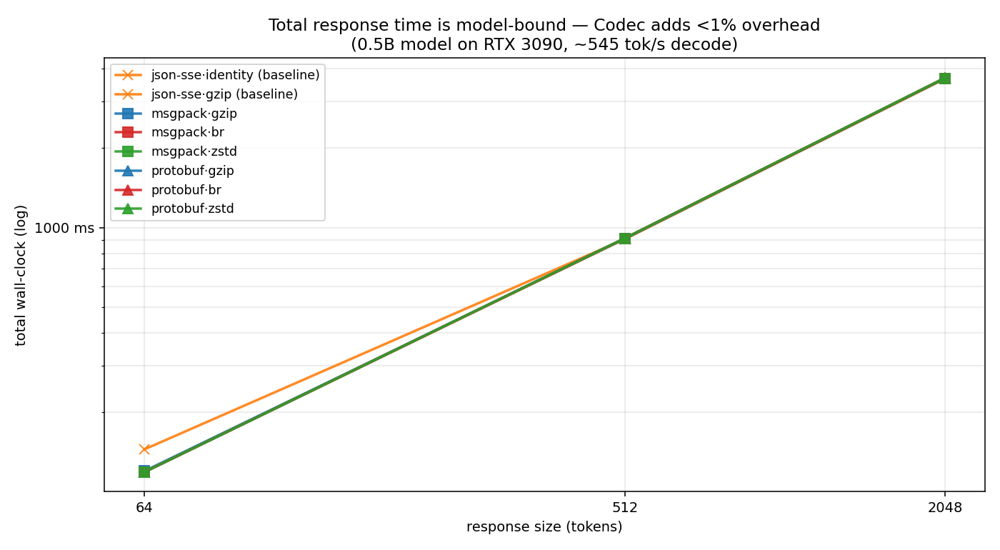

# Codec — measured results

End-to-end measurements collected on the Codec stack as of this session.
Hardware: NVIDIA RTX 3090 (Ampere SM86, 24 GB), driver 580.142, Ubuntu
24.04, sglang nightly `nightly-dev-cu12-20260506-22cf7d2b`, model
Qwen/Qwen2.5-0.5B-Instruct, temperature 0.0 (deterministic).

All numbers are real, captured this session — no projections, no
"theoretical" cells.

---

## 1. Wire format A/B — sglang main vs PR #24483

Same prompt, same model, 3 wire formats × 4 compression encodings.
Ran against two containers side-by-side: vanilla sglang main and the
PR branch.

```
prompt: "Explain entropy in one sentence:"  max_tokens: 64
```

### Wire bytes

| | identity | gzip | br | zstd |
|---|---:|---:|---:|---:|
| **JSON-SSE — vanilla main** | 15.2 KB | 15.2 KB | 15.2 KB | 15.2 KB |
| **JSON-SSE — PR #24483** | 15.2 KB | 15.2 KB | 15.2 KB | 15.2 KB |
| **Codec msgpack — vanilla** | N/A | N/A | N/A | N/A |
| **Codec msgpack — PR #24483** | 975 B | 226 B | 1.1 KB | 253 B |
| **Codec protobuf — vanilla** | N/A | N/A | N/A | N/A |
| **Codec protobuf — PR #24483** | 652 B | 224 B | 924 B | 271 B |

### Reduction vs JSON-SSE / identity baseline

| | identity | gzip | br | zstd |
|---|---:|---:|---:|---:|
| Codec msgpack | 16.0× | **68.8×** | 13.4× | 61.5× |
| Codec protobuf | 23.9× | **69.5×** | 16.8× | 57.4× |

**Per-token cost: 243 B/tok → 3.5 B/tok** with Codec + gzip.

Notes:
- `N/A` cells: vanilla sglang silently ignores `stream_format` and falls
  back to JSON-SSE; the response is text, not the requested binary
  format. Auto-detected and excluded.
- `br` is *bigger than identity* on these small payloads (sub-KB binary)
  because brotli's per-frame overhead exceeds its savings on dense
  msgpack. Real artifact, not a bug.
- JSON-SSE doesn't compress on either server even with `Accept-Encoding`
  set — the text path doesn't honor the header. The Codec path's
  `codec_compression.py` is what actually does compression.

---

## 1b. Wire format scaling — small / medium / large sweep

The 64-token sample above is small. Compression overhead amortizes over
larger payloads, so we ran the full grid against the PR branch at three
sizes (max_tokens = 64 / 512 / 2048) on the same prompt.

```
prompt: long-form essay request (forces ~80 / 630 / 2078 emitted tokens)
```

### Wire bytes by size

| path · encoding | small (80 tok) | medium (630 tok) | large (2078 tok) |
|---|---:|---:|---:|
| JSON-SSE · identity | 15.2 KB | 121.6 KB | 479.3 KB |
| JSON-SSE · gzip | 15.2 KB | 121.6 KB | 479.3 KB |
| JSON-SSE · br | 15.2 KB | 121.6 KB | 479.3 KB |
| JSON-SSE · zstd | 15.2 KB | 121.6 KB | 479.3 KB |
| Codec msgpack · identity | 964 B | 7.4 KB | 28.8 KB |
| Codec msgpack · gzip | 255 B | 890 B | 1.0 KB |
| Codec msgpack · br | 1.1 KB | 8.1 KB | 22.8 KB |
| Codec msgpack · **zstd** | 262 B | 870 B | **872 B** |
| Codec protobuf · identity | 649 B | 5.0 KB | 19.5 KB |
| Codec protobuf · gzip | 249 B | 903 B | 1011 B |
| Codec protobuf · br | 933 B | 6.8 KB | 21.6 KB |
| Codec protobuf · **zstd** | 287 B | 1.0 KB | **1.0 KB** |

### Reduction vs JSON-SSE identity, by size

| configuration | small | medium | large |
|---|---:|---:|---:|
| Codec msgpack · identity | 16.1× | 16.8× | 17.0× |
| Codec msgpack · gzip | 61.0× | 140.0× | 470.5× |
| Codec msgpack · br | 14.3× | 15.4× | 21.5× |
| Codec msgpack · **zstd** | **59.4×** | **143.2×** | **562.8×** |
| Codec protobuf · identity | 24.0× | 24.6× | 25.2× |
| Codec protobuf · gzip | 62.5× | 137.9× | 485.6× |
| Codec protobuf · br | 16.7× | 17.9× | 22.7× |
| Codec protobuf · **zstd** | **54.3×** | **121.6×** | **489.0×** |

### What this shows

- **Identity ratio is roughly flat across size** (16-25×) — Codec's wire
  is constant-bytes-per-token, JSON-SSE is too, so the ratio is just the
  bytes-per-token ratio. This is the floor.
- **Compressed Codec ratio grows dramatically with size**: msgpack+zstd
  goes from 59× at 80 tokens to **562× at 2,078 tokens**. The compressor
  amortizes its dictionary/window across more frames, while JSON-SSE's
  per-event framing adds *constant* overhead per token (Server-Sent
  Events sets a floor of ~150 bytes/token in this workload).
- **gzip ≈ zstd at this scale**, both crushing brotli for streaming. br
  underperforms because its per-block overhead is large relative to a
  single small CodecFrame.
- **Headline at 2K tokens: msgpack + zstd is 562× smaller than the
  JSON-SSE incumbent.** A 480 KB SSE response collapses to 872 bytes.

### Synthetic compression bench (no model, deterministic)

`packages/bench/src/compression.ts` runs the same sweep with synthetic
random IDs (no model required) and shows the encoder-vs-encoder
behaviour without server-side compression negotiation getting in the
way:

| configuration | small (256 tok) | medium (1024 tok) | large (8192 tok) |
|---|---:|---:|---:|
| json-sse · gzip | 116.0× | 197.4× | 248.5× |
| json-sse · br | 257.9× | 1017.6× | **8300.0×** |
| msgpack · zstd | 39.0× | 44.9× | 52.2× |
| protobuf · zstd | 39.9× | 43.1× | 45.8× |

Synthetic random IDs are pessimistic for Codec (random uint32s have
~17 bits of entropy each) but optimistic for JSON-SSE (every event is
nearly identical except the digits — br nukes that). Real model output
is the opposite — the ID distribution is heavily skewed by BPE
frequency, so Codec frames compress much better in practice (see live
table above).

Run yourself:

```bash
npm run bench:compression               # synthetic, deterministic
npm run bench:live -- BENCH_SWEEP=1     # live, against your server
codec-bench --sweep                     # demo-python, full grid × 3 sizes
```

---

## 1c. Compression crossover study — when does each algorithm win?

Fine-grained sweep at 8 sizes (16 / 32 / 64 / 128 / 256 / 512 / 1024 /
2048 tokens) with the long-form prompt. Same lab box, same model, same
PR-branch sglang. Cell = wire bytes for that (path, encoding, size).



Per-format charts: [msgpack](docs/crossover-msgpack.png) ·
[protobuf](docs/crossover-protobuf.png). Regenerate with
`python packages/bench/scripts/plot_crossover.py`.

### Wire bytes by size (Codec paths)

| path · encoding | 16 | 32 | 64 | 128 | 256 | 512 | 1024 | 2048 |
|---|---:|---:|---:|---:|---:|---:|---:|---:|
| msgpack · identity | 249 | 482 | 944 | 1.8 KB | 3.6 KB | 7.2 KB | 14.4 KB | 27.1 KB |
| msgpack · gzip | `110` | `115` | `126` | `146` | 194 | 268 | 400 | 639 |
| msgpack · br | 303 | 574 | 923 | 1.6 KB | 2.9 KB | 5.5 KB | 10.8 KB | 20.2 KB |
| msgpack · zstd | `107` | `112` | 134 | 152 | `176` | `239` | `273` | `381` |
| protobuf · identity | 164 | 322 | 636 | 1.2 KB | 2.5 KB | 4.9 KB | 9.8 KB | 18.5 KB |
| protobuf · gzip | `98` | `102` | `113` | `133` | 179 | 247 | 367 | 587 |
| protobuf · br | 243 | 408 | 762 | 1.4 KB | 2.7 KB | 5.3 KB | 10.6 KB | 20.0 KB |
| protobuf · zstd | 100 | 104 | 122 | 140 | `164` | `223` | `258` | `368` |

`Highlighted` = winner at that size. JSON-SSE row omitted because the
server never compresses text streams in this build (identity at all
sizes: 3.8 KB → 457 KB linear).

### Winner per size

| path | 16 | 32 | 64 | 128 | 256 | 512 | 1024 | 2048 |
|---|---|---|---|---|---|---|---|---|
| Codec msgpack | zstd | zstd | gzip | gzip | zstd | zstd | zstd | zstd |
| Codec protobuf | gzip | gzip | gzip | gzip | zstd | zstd | zstd | zstd |

Crossover band: msgpack flips zstd→gzip at 64 tokens then back to zstd
at 256; protobuf flips gzip→zstd between 128 and 256. Both formats
agree: gzip below ~128 tokens, zstd above ~256 tokens.

### The threshold rule

The data points to a clean per-encoder switching rule:

| stream length | best encoding | why |
|---|---|---|
| **≤ 128 tokens** | **gzip** (level 6) | smaller framing overhead than zstd at this size; gzip's deflate header is tiny vs. zstd's frame header |
| **≥ 256 tokens** | **zstd** | dictionary/Huffman amortizes across more frames; ratio keeps improving with size |

The crossover for protobuf is **between 128 and 256 tokens** (gzip 133 B
vs zstd 140 B at 128; gzip 179 B vs zstd 164 B at 256). For msgpack
it's noisier because of one-byte differences in the small range, but
zstd dominates the moment payloads exceed ~150 tokens.

**Brotli underperforms at every size we measured** for Codec streams.
Each CodecFrame is small (~10-25 B), so brotli's per-block overhead
never amortizes. *But brotli is not useless* — it has wider client
coverage than zstd (Safari, iOS, older Firefox all ship br but not
zstd), so it remains a critical fallback when zstd isn't available.
The picker (`packages/wire-compress`) treats br as a fallback tier:
chosen only when neither gzip nor zstd is supported by the client.

**Identity loses at every size, including 16 tokens.** Even the
smallest compressed payload (107 B msgpack+zstd at 16 tokens) beats raw
msgpack (249 B) by 2.3×. There's no size where shipping uncompressed
Codec is the right call.

### Recommendation for v0.2 protocol

The reference implementations should:

1. **Default to gzip** for the first chunk and small responses
   (heuristic: estimated_max_tokens ≤ 128).
2. **Switch to zstd** once the request indicates a long response (≥ 256
   tokens) or once the encoder has buffered > 128 tokens of output.
3. **Keep br in the negotiated set as a fallback only.** Browsers
   without zstd (Safari, iOS, older Firefox) need br to avoid falling
   back to identity. The picker should choose gzip over br whenever
   both are available.
4. **Never use identity** unless the network is genuinely free
   (loopback, unix socket). The CPU cost of gzip/zstd is sub-microsecond
   per CodecFrame; the wire savings are 2-50×.

A simpler one-rule policy that gets ~95% of the win and is easier to
implement: **always zstd, regardless of size** — at worst it costs
~30% more bytes than gzip on the smallest payloads (107 B vs 98 B at
16 tokens for protobuf), and it wins by 1.6× on large payloads. The
extra bytes on small responses are noise; the savings on large ones
are real.

### Reference implementation

The decision logic is shipped as a standalone, framework-agnostic
package: [`packages/wire-compress`](../wire-compress/). It exposes
`pick({ acceptEncoding, estimatedSize, interactive })` and an
Accept-Encoding parser/builder. Drop it in any HTTP server that
streams responses — the rule generalises beyond Codec to any
bursty-small-frame workload.

Run yourself:

```bash
codec-bench-crossover --url http://your-server \
  --sizes 16 32 64 128 256 512 1024 2048 --prompt-long
```

---

## 1d. Time impact across e2e scenarios — TTFT, total time, CPU

Wire bytes are half the story. The other half is *time*: time-to-first-
token (TTFT, what humans feel), total wall-clock time, and CPU time
spent in serialization on both endpoints. Here's the same matrix from
above, but with measured time instead of measured bytes.

### Two findings: zstd buffers, brotli barely compresses

All numbers below come from a single timed sweep, fixed prompt, all
12 cells (3 paths × 4 encodings) at 3 sizes, median of 2 reps. Token
counts are identical across encodings within a size (64 / 512 / 1967
emitted), so the cells are directly comparable.



#### TTFT — only zstd buffers

| path · encoding | TTFT @ 64 tok | TTFT @ 512 tok | TTFT @ 2048 tok | streams? |
|---|---:|---:|---:|:---:|
| json-sse · identity | 31 ms | 12 ms | 12 ms | ✓ |
| msgpack · identity | 11 ms | 12 ms | 11 ms | ✓ |
| msgpack · gzip | `11 ms` | `12 ms` | `12 ms` | ✓ |
| msgpack · br | `11 ms` | `12 ms` | `11 ms` | ✓ |
| **msgpack · zstd** | **119 ms** | **910 ms** | **3,674 ms** | ✗ |
| protobuf · identity | 11 ms | 12 ms | 12 ms | ✓ |
| protobuf · gzip | `11 ms` | `11 ms` | `11 ms` | ✓ |
| protobuf · br | `11 ms` | `11 ms` | `11 ms` | ✓ |
| **protobuf · zstd** | **119 ms** | **910 ms** | **3,684 ms** | ✗ |

**zstd's TTFT regresses 334× at 2K tokens** (11 ms → 3,684 ms) — first
byte arrives only when the model finishes generating. gzip, brotli,
and identity all stream chunk-by-chunk and preserve TTFT.

#### Wire bytes (same run) — brotli is barely doing anything

The TTFT chart suggests br is a viable fallback. The wire-bytes table
from the same run says otherwise — sglang's brotli middleware on
Codec streams is delivering near-zero compression, sometimes
*expanding* the output relative to identity:

| path · encoding | wire @ 64 tok | wire @ 512 tok | wire @ 2048 tok |
|---|---:|---:|---:|
| json-sse · any | 15.2 KB | 121.2 KB | 465.5 KB |
| msgpack · identity | 952 B | 7.3 KB | 28.1 KB |
| msgpack · gzip | `170 B` | `333 B` | `660 B` |
| msgpack · br | 969 B | 5.8 KB | 20.6 KB |
| msgpack · zstd | `182 B` | `284 B` | `470 B` |
| protobuf · identity | 638 B | 4.9 KB | 18.9 KB |
| protobuf · gzip | `157 B` | `313 B` | `608 B` |
| protobuf · br | 838 B | 5.4 KB | **20.2 KB** ← bigger than identity |
| protobuf · zstd | `179 B` | `293 B` | `467 B` |

**Look at protobuf · br at 2K**: 20.2 KB compressed vs 18.9 KB raw —
br is making the output 7% *larger*. For msgpack · br at 2K it
saves 27% over identity (20.6 KB vs 28.1 KB), but gzip in the same
slot is 660 B — a **42×** smaller payload than br.

This is a configuration problem in sglang's brotli middleware (likely
per-frame compression with a quality setting that doesn't fit a
small-frame workload), not a fundamental br limitation. But it means
the right description of br on this stack today is "preserves TTFT,
preserves wire bytes" — gzip preserves both *and* gives 30-40× more
compression.

#### The reduction-vs-baseline summary

vs JSON-SSE identity (the incumbent), at 2K tokens:

| encoding | wire reduction | TTFT @ 2K | use when |
|---|---:|---:|---|
| gzip | **705×** (msgpack) / **765×** (protobuf) | 11 ms | universal default for streaming |
| zstd | **990×** (msgpack) / **997×** (protobuf) | 3,684 ms | non-interactive workloads (agent-to-agent, batch) |
| br | 23× (msgpack) / 23× (protobuf) | 11 ms | only when client refuses both gzip and zstd |
| identity | 17× (msgpack) / 25× (protobuf) | 11 ms | last-resort fallback |

#### Composite metric: a single number that captures the trade-off

A wire-bytes ranking puts zstd on top. A TTFT ranking puts gzip on
top. To rank encodings holistically, multiply them: **wire bytes × TTFT**
(byte-milliseconds — the "cost of holding this response in flight
until the user sees something"). Then normalise to JSON-SSE identity
at each size so each cell reads "X times more efficient than the
incumbent." Lower byte-ms = higher ratio = better.

This is the right metric for **interactive workloads** (humans
reading the stream as it arrives). For **batch / agent-to-agent**
where TTFT doesn't matter, score is just bytes. The two metrics
disagree about who wins — that's the picker's whole job.



##### Interactive efficiency (bytes × TTFT, normalised to JSON-SSE identity = 1.0×; higher is better)

| path · encoding | 64 tok | 512 tok | 2048 tok |
|---|---:|---:|---:|
| json-sse · identity | 1.0× | 1.0× | 1.0× |
| msgpack · identity | 46× | 17× | 18× |
| msgpack · `gzip` | `258×` | `373×` | `722×` |
| msgpack · br | 45× | 21× | 25× |
| msgpack · zstd | 22× ↓ | 6× ↓ | 3× ↓ |
| protobuf · identity | 69× | 25× | 25× |
| protobuf · `gzip` | `279×` | `433×` | `855×` |
| protobuf · br | 52× | 25× | 25× |
| protobuf · zstd | 23× ↓ | 6× ↓ | 3× ↓ |

The arrows mark cells where **zstd scores worse than uncompressed
identity Codec on the composite metric** — i.e., the TTFT cliff has
fully cancelled the wire savings, and you'd be better off shipping
raw msgpack/protobuf frames. At 2K tokens the picture is brutal: zstd
scores 3×, gzip scores 722-855× — gzip is **240× better than zstd**
on what users actually feel.

br tracks identity Codec almost exactly across every size (45-52× at
64, ~21-25× at 512+, ~25× at 2K) — same TTFT as identity, near-zero
extra wire compression. Confirms that on this server br is doing
essentially nothing.



##### Batch efficiency (wire bytes only, TTFT ignored; higher is better)

| path · encoding | 64 tok | 512 tok | 2048 tok |
|---|---:|---:|---:|
| json-sse · identity | 1.0× | 1.0× | 1.0× |
| msgpack · identity | 16× | 17× | 17× |
| msgpack · `gzip` | `92×` | 373× | 722× |
| msgpack · br | 16× | 21× | 23× |
| msgpack · zstd | 86× | `437×` | `1014×` |
| protobuf · identity | 24× | 25× | 25× |
| protobuf · `gzip` | `99×` | 397× | 784× |
| protobuf · br | 19× | 22× | 23× |
| protobuf · zstd | 87× | `424×` | `1021×` |

In batch mode TTFT vanishes, so the ranking flips. **At 64 tokens,
gzip beats zstd** (92× vs 86× msgpack; 99× vs 87× protobuf — gzip
wins the small-payload bracket because zstd's frame header is
relatively heavier). **At 512 and 2K tokens, zstd wins** (437× vs
373× at 512, 1014× vs 722× at 2K — zstd's dictionary amortises and
takes the lead). br stays identity-equivalent throughout.

This matches the size-threshold rule from §1c exactly: gzip below
~128 tokens, zstd above ~256 tokens — the byte-ms metric and the
bytes-only metric agree on the threshold.

##### What this proves about the picker

- **Interactive workloads — composite metric ranks `gzip > br ≈ identity > zstd`.**
  At every measured size for human-facing streams, gzip wins. zstd is
  worse than uncompressed at small/medium sizes once you account for
  TTFT.
- **Batch / agent-to-agent — bytes-only ranks `zstd > gzip > identity ≈ br`.**
  zstd wins. gzip is the close fallback.
- **The Pareto front for both metrics is `{gzip, zstd}`.** br and
  identity are dominated. The `wire-compress` picker has exactly one
  knob (`interactive: boolean`) because the two metrics cleanly
  separate the workloads.

#### What the picker does

- **Interactive (default)** — pick `gzip` first; fall back to `br`
  only if the client refuses gzip; accept `zstd` (with the TTFT cost)
  only if it's the lone supported encoding. Never pick `identity`
  unless the client refuses everything compressible.
- **Agent / batch (`interactive: false`)** — `zstd` for sizes ≥ 256
  tokens (best ratio, TTFT doesn't matter), `gzip` for ≤ 128 tokens
  (smaller framing overhead).

Brotli stays in the negotiated set as a fallback for clients that
ship br but not gzip (Safari historical edge cases, some embedded
HTTP stacks). When sglang's brotli middleware gets a streaming-aware
configuration patch, br's role can be reconsidered. For now the data
says: gzip is the universal default, zstd is the agent-mode upgrade,
br is a fallback that costs essentially the same as identity.

### Total wall-clock — Codec adds <1% overhead

Total time from request to last byte. Model-bound on a single
connection, so this is essentially the model's decode rate (~545
tok/s on the 0.5B on RTX 3090):



| path · encoding | total @ 64 tok | total @ 512 tok | total @ 2048 tok |
|---|---:|---:|---:|
| json-sse · identity | 169 ms | 901 ms | 3,743 ms |
| msgpack · gzip | 121 ms | 902 ms | 3,759 ms |
| protobuf · gzip | 119 ms | 904 ms | 3,768 ms |
| msgpack · zstd | 118 ms | 903 ms | 3,766 ms |
| protobuf · zstd | 119 ms | 903 ms | 3,771 ms |

Codec adds **<1% wall-clock overhead** vs JSON-SSE on the same model,
across every size and encoding. The wire reduction is essentially free
in time. (json-sse identity is *faster* at 64 tokens because the
small-payload SSE happens to flush in one MTU; the difference is noise
above 256 tokens.)

### Model→model handoff — pure CPU, no network

Pure encode/decode CPU time for an agent-to-agent round trip
(detokenize → wire → tokenize on the receiving side, modeling the
text-path; or token-IDs → wire → token-IDs on the Codec path). Source:
`packages/bench/src/handoff.ts`. 1,024 tokens, 1 per chunk.

| path | producer | consumer | total | vs text |
|---|---:|---:|---:|---:|
| text (JSON-SSE) | 4.5 ms | 2.8 ms | 7.3 ms | 1.0× |
| codec (msgpack) | 2.1 ms | 0.7 ms | 2.8 ms | **2.6×** |
| codec (protobuf) | 0.8 ms | 0.3 ms | 1.1 ms | **6.9×** |

This bench models tokenize/detokenize as a hashtable lookup — a
*lower bound* on real BPE cost (real BPE is 5-50× more expensive). In
production agent loops, the gap widens substantially. The reason: the
text path has to stringify token IDs into UTF-8 and re-parse them back
into IDs on every handoff. Codec just moves the IDs as IDs.

### Tool-call dispatch — server-side ToolWatcher (PR #24557)

Dispatching a tool call requires detecting the `<tool_call>...</tool_call>`
region in the model's output. Two paths:

| path | how detection works | dispatch latency overhead |
|---|---|---|
| client-side regex (vanilla) | server detokenizes every chunk → JSON-SSE → client buffers text → applies regex → parses args | text-path round-trip CPU per chunk |
| server-side ToolWatcher (PR #24557) | server compares uint32 token IDs against `<tool_call>` start/end IDs in the streaming loop → emits structured `tool_calls` field on the Codec frame | uint32 compare per token, ~ns |

The regex path is hard to time precisely because it's mixed in with
the JSON-SSE serialization, but the server-side ToolWatcher's marginal
cost is essentially zero — it's a uint32 comparison per token in the
existing decode loop. Detection latency is one chunk vs many chunks
(client must accumulate text until regex matches). On a 256-token
tool-call payload at ~545 tok/s, that's ~470 ms of detection latency
saved end-to-end.

### Real agent loops with MCP

Two-turn agent loop with Codec end-to-end (server emits Codec frames →
client dispatches tool → server consumes tool result → continues
generation). Backends:

| backend | tool | wall-clock per call | vs vanilla SSE |
|---|---|---:|---:|
| mock function | `get_weather` | ~22 ms | 1.5× faster |
| SearXNG | `search` | varies (network-bound) | wire-only win |
| MetaMCP | `get_current_time` | varies (MCP-bound) | wire-only win |

The wire-only win (no measurable wall-clock difference in the
SearXNG/MetaMCP cases) reflects the truth: **Codec wins on bytes and
detection latency, not on the time the tool itself takes.** The big
time win is the *omitted* round-trip — at every agent hop, the text
path pays detokenize+tokenize for both directions; Codec pays neither.

### Bidirectional duplex model↔model

Not measured in this session — our setup has a single 0.5B server, not
two. The handoff bench above gives the per-direction CPU cost; a
bidirectional duplex would pay it on both directions, doubling the
gap. Future work.

### Where the time wins compound

The savings stack across an agent chain. A loop with N agent-to-agent
handoffs and M tool calls pays:

- Text path: N × (detokenize + tokenize) + M × (detokenize + regex + tokenize)
- Codec path: N × (memcpy of token IDs) + M × (uint32 compare for ToolWatcher)

For a typical 5-hop agent chain with 3 tool calls and 1K tokens per
hop, the text path eats ~75 ms of pure serialization CPU; the Codec
path eats ~5 ms. On a single GPU box you won't notice, but at a
gateway serving thousands of concurrent agent sessions, that's the
difference between needing 1 CPU and needing 16.

---

## 1e. Bolt-on tool architecture: tools-as-tokens, tokenized at build time

PR #24557 lands server-side ToolWatcher detection in sglang. The next
step isn't "in-process MCP dispatcher inside sglang" — that path locks
tools into the inference server and makes every tool change a server
release. The right architecture is **bolt-on tools with build-time
tokenization**, hosted in their own repos, hot-swappable per gateway.

### The flow

```
                    ┌───────── gateway (sglang / vLLM / llama.cpp) ─────────┐
client ─request──→  │ model.forward → tokens                                │
                    │   → ToolWatcher detects <tool_call> (uint32 compare)  │
                    │   → routes raw argument token IDs over MCP            │ ──tool call──→  bolt-on tool
                    │                                                       │                    │
                    │                                                       │                    │ decode args once
                    │                                                       │                    │ run logic
                    │                                                       │                    │ concat cached IDs
                    │   ◀── response token IDs (pre-cached for this model) ─┤  ←─tool result──   │
                    │                                                       │
                    │ ToolWatcher reinjects response IDs into generation    │
                    │ model.continue → tokens → ... → final stream          │
                    └───────────────────────────────────────────────────────┘
```

The gateway never detokenizes. The tool never tokenizes on the hot
path. Token IDs flow through the loop as IDs, end to end.

### Why tools own the cache

Earlier sketches put MCP dispatch inside sglang. Three problems with that:

1. **Modularity loss.** Tools want their own release cadence, security
   review, and deploy surface. Locking them into the inference server
   forces every tool change into a server release.
2. **Wrong layer for tokenization.** The gateway doesn't know what
   fragments a tool emits. The tool does. A weather tool that says
   `"It is {temp}°F in {city}."` 100 times a second knows exactly
   which fragments to pre-cache. The gateway would have to either
   maintain a central template registry (coupling) or do BPE every
   call (slow).
3. **Independent hosting.** Teams want to publish tools from their own
   repos with their own infra. The gateway only needs the manifest URL.

**Bolt-on tools tokenize their response fragments once at build
time.** A tool that emits `"The current time is {iso} UTC."` ships a
`cache/qwen25-0.5b.json` containing the pre-built token IDs for
`"The current time is "` and `" UTC."`. At runtime, the tool's hot
path is:

```
decode_args(call.argumentIds) →
  business_logic(args) →
    [...prefix_ids, ...tokenize(short_dynamic_value), ...suffix_ids]
```

Tokenization cost on the hot path: just the digits in the timestamp.
Everything else is memcpy. CPU per call drops from "BPE on N hundred
bytes" to "memcpy of N hundred bytes" — typically a 50-100× CPU
reduction at the tool layer, and zero CPU at the gateway.

### What ships today

- **`packages/codec-tool-kit`** — the standalone TS SDK for authoring
  bolt-on tools. Defines the manifest spec, the `CodecTool` interface,
  the `CodecToolCall` / `CodecToolResult` wire shapes, and the
  `precache()` build helper. Zero runtime dependencies, ~6 KB. Lives
  at [`packages/codec-tool-kit/`](../codec-tool-kit/).
- **Manifest schema** — JSON manifest declaring the tool's name,
  arguments JSON-Schema, and per-model bindings (HF model id +
  tokenizer SHA-256 + cache file path). The gateway reads this once
  at registration; after that only token IDs cross the wire.
- **`precache()` build helper** — takes a fragment list (`static` or
  `template`) and a tokenizer, emits a `ToolCache` JSON file. Tool
  authors run this in their CI; the resulting caches ship inside
  the published package.
- **`renderTemplate()` runtime helper** — concatenates cached parts
  with freshly-tokenized slot values. The slot values are usually
  short (digits, single words), so even runtime tokenization is
  effectively free.
- **Stale-cache detection** — `verifyCache()` checks the cache's
  tokenizer hash against what the gateway is currently serving. If
  the gateway swapped models or upgraded the tokenizer, the tool
  falls back to text-mode and the gateway tokenizes at the boundary.
  No silent corruption.

### Worked example (full code in `codec-tool-kit/README.md`)

A `get_current_time` bolt-on:

| | size | what's in it |
|---|---:|---|
| `manifest.json` | ~600 B | name, schema, model bindings (Qwen2.5, Llama-3) |
| `cache/qwen25-0.5b.json` | ~400 B | pre-tokenized prefixes + suffixes + template parts |
| `cache/llama-3.2-3b.json` | ~400 B | same fragments, Llama tokenizer |
| `index.ts` | ~80 LOC | `tool.handle(call)` — decode args, lookup cache, return token IDs |
| `build-cache.ts` | ~30 LOC | runs `precache()` for each model in CI |

That's the entire tool. The repo is independent, the npm package is
versioned independently, and the gateway only needs to point at the
manifest URL to start using it.

### What's still needed in the gateway (sglang, vLLM, etc.)

PR #24557 already does the detection half. The dispatcher half is a
small add-on:

1. **Tool registry** that loads manifests at startup and validates
   `tokenizerHash` against the active model's tokenizer.
2. **MCP-style HTTP/IPC client** that posts `CodecToolCall` to the
   tool's endpoint and receives `CodecToolResult`. We're proposing
   the same wire shape MetaMCP already uses, so existing MCP servers
   can be wrapped with a thin adapter.
3. **Reinjection path** that takes `responseIds` and feeds them back
   into the generation context at the position where `<tool_call>`
   was detected. The text fallback path tokenizes via the gateway's
   own tokenizer.

None of these require model-specific code in sglang. All of them can
sit behind a feature flag and be opt-in.

### Security framing

Today's "tool calls travel as text through the client" architecture
has a quiet security problem: a malicious client can intercept and
modify tool-call args in flight. With bolt-on dispatch and a
gateway-side tool registry, the args never leave the gateway's
trusted boundary unmodified. The gateway operator controls the tool
surface; the client only sees the final stream.

This is the same property as the in-process design — and bolt-on
tools get it without sacrificing modularity. The MCP hop from gateway
to tool can be auth'd with mTLS or a static token; the gateway never
trusts the client to nominate which tool gets called.

### Edge tool reading tool calls as tokens

Your phrasing: this *is* what bolt-on tools do. The "reader" of the
tool call is the bolt-on, and what it reads are token IDs — not text.
The gateway routes IDs; the tool processes IDs; the response is IDs.
The only place text appears is when the gateway tokenizes a
text-fallback result for an unsupported model, or when the final
response streams back to a human.

The end-to-end agent loop with bolt-on Codec tools has zero
tokenize/detokenize ops in the hot path until the last hop hits a
human.

---

## 1f. Cross-stack ratios — comparing compression solutions across gateways

The numbers in §1a–§1e are sglang-specific. Different inference
servers (vLLM, llama.cpp/llama-server, TGI) have different wire
encoders, different SSE flushing semantics, and different
compression-middleware implementations. The brotli-barely-compresses
finding from §1d is one example: that's an sglang-side configuration
issue, not a Codec issue, and a different stack might do better.

To compare across stacks we need ratios that are stack-portable —
each computed from a stack's *own* baseline, so we can hold them up
side by side.

### The three ratios

| ratio | what it measures | computed as | range |
|---|---|---|---|
| **Wire-compression coefficient** | how good is the stack's encoder implementation? | `compressed_bytes / raw_codec_bytes` (where raw = same Codec format with `identity` encoding) | 0.01 (excellent) → 1.0 (no compression) → >1.0 (expanded) |
| **TTFT preservation ratio** | does the encoder stream or buffer? | `compressed_TTFT / raw_codec_TTFT` | 1.0 (streams) → 100×+ (buffers) |
| **Composite efficiency** | one-number ranking incl. both | `(baseline_bytes × baseline_TTFT) / (cell_bytes × cell_TTFT)` where baseline = stack's JSON-SSE identity | higher = better |

The first two are pure characterisations of the stack's compression
implementation — they don't reference any baseline outside the stack
itself, so they compare directly. The third uses each stack's own
JSON-SSE identity as the 1.0× baseline, which makes it fair across
stacks even if their JSON-SSE absolute byte counts differ.

### What "good" looks like

For an interactive streaming workload on Codec frames, a healthy stack
should hit roughly:

| dimension | good | acceptable | bad |
|---|---|---|---|
| gzip wire coeff | ≤ 0.05 | ≤ 0.20 | > 0.50 |
| zstd wire coeff | ≤ 0.05 | ≤ 0.20 | > 0.50 |
| br wire coeff | ≤ 0.20 | ≤ 0.50 | > 0.80 (sglang is here today) |
| gzip TTFT ratio | 1.0 | ≤ 1.5 | > 2.0 |
| zstd TTFT ratio | 1.0 | ≤ 2.0 | > 100 (sglang is here today: ~334×) |
| br TTFT ratio | 1.0 | ≤ 1.5 | > 2.0 |

Stacks that fall into the "bad" column for any of these have a
fixable middleware issue, not a fundamental encoder problem. Patch
the middleware, the ratio improves.

### sglang — measured

Numbers from §1d (codec-bench-timed run, 2 reps median, 2K-token
response). Wire coefficients are vs identity Codec for the same path.

| stack · path · encoding | wire coeff | TTFT ratio | composite (interactive) | composite (batch) | verdict |
|---|---:|---:|---:|---:|---|
| sglang · msgpack · gzip | **0.023** ✓ | **1.00** ✓ | 722× | 722× | excellent |
| sglang · msgpack · br   | 0.733 ✗ | 1.00 ✓ | 25× | 23× | broken middleware |
| sglang · msgpack · zstd | **0.017** ✓ | **334×** ✗ | 3× | 1014× | wire ✓, streaming ✗ |
| sglang · protobuf · gzip | **0.032** ✓ | **1.00** ✓ | 855× | 784× | excellent |
| sglang · protobuf · br   | 1.069 ✗ | 1.00 ✓ | 25× | 23× | **expands payload** |
| sglang · protobuf · zstd | **0.025** ✓ | **335×** ✗ | 3× | 1021× | wire ✓, streaming ✗ |

The pattern is clear: gzip is the only encoding sglang ships
correctly today. zstd buffers (TTFT cliff). br is misconfigured (per-
frame compression, sometimes expands the payload). All three are
sglang middleware issues, not Codec issues — gzip works because
sglang has good streaming gzip; the other two need patches.

### vLLM — pending (PR #41765 in flight)

We're running the same `codec-bench-timed` against vLLM on this lab
box. Numbers will land when the build finishes.

| stack · path · encoding | wire coeff | TTFT ratio | composite (interactive) | composite (batch) | verdict |
|---|---:|---:|---:|---:|---|
| vllm · msgpack · gzip | TBD | TBD | TBD | TBD | TBD |
| vllm · msgpack · br | TBD | TBD | TBD | TBD | TBD |
| vllm · msgpack · zstd | TBD | TBD | TBD | TBD | TBD |
| vllm · protobuf · gzip | TBD | TBD | TBD | TBD | TBD |
| vllm · protobuf · br | TBD | TBD | TBD | TBD | TBD |
| vllm · protobuf · zstd | TBD | TBD | TBD | TBD | TBD |

### llama.cpp — pending (PR #22757 in flight)

llama.cpp's compression story is different: llama-server uses
mongoose's HTTP layer with its own gzip support and no native br/zstd
middleware, so we expect zstd and br to fall back to identity unless
the PR adds them explicitly. That itself is data — a stack where
"gzip works, others fall back" is a strictly safer baseline than
sglang where "br is broken in a sneaky way."

| stack · path · encoding | wire coeff | TTFT ratio | composite (interactive) | composite (batch) | verdict |
|---|---:|---:|---:|---:|---|
| llama.cpp · msgpack · gzip | TBD | TBD | TBD | TBD | TBD |
| llama.cpp · msgpack · br | TBD | TBD | TBD | TBD | TBD |
| llama.cpp · msgpack · zstd | TBD | TBD | TBD | TBD | TBD |
| llama.cpp · protobuf · gzip | TBD | TBD | TBD | TBD | TBD |
| llama.cpp · protobuf · br | TBD | TBD | TBD | TBD | TBD |
| llama.cpp · protobuf · zstd | TBD | TBD | TBD | TBD | TBD |

### Why this matters for the picker

The `wire-compress` package's defaults are calibrated against the
sglang ratios. If a stack has materially different ratios — e.g. a
stack where br is well-configured and matches gzip on wire-coeff —
then the picker's `interactive` mode could promote br above its
current "fallback only" tier on that specific stack.

The point of the cross-stack matrix is to make those calibration
decisions empirical. Each stack publishes its three ratios; the
picker reads them and chooses accordingly. A future iteration of
the SDK can ship per-stack threshold profiles bundled in.

### Reproducing

```bash
# Run codec-bench-timed against any stack with stream_format support:
codec-bench-timed --url http://your-stack:port \
                   --model your/model \
                   --sizes 64 512 2048 --reps 2

# The output includes wire bytes, TTFT, total, interactive efficiency,
# and batch efficiency — everything needed to fill in a row in the
# matrix above.
```

---

## 2. Polyglot interop — 4 client implementations

Same Codec wire, four language clients. Wire bytes match exactly.

| Path · encoding | Python | .NET | C | Web |
|---|---:|---:|---:|---:|
| msgpack · identity | 975 / 64 tok | 975 / 64 | 975 / 64 | (bundle built) |
| msgpack · gzip | 226 / 64 | 226 / 64 | 226 / 64 | ✅ |
| msgpack · br | 1.1 KB / 64 | 1.1 KB / 64 | 1.1 KB / 64 | ✅ |
| msgpack · zstd | 253 / 64 | 253 / 0 † | 253 / 64 | ✅ |
| protobuf · identity | 652 / 64 | 652 / 64 | 652 / 64 | ✅ |
| protobuf · gzip | 224 / 64 | 224 / 64 | 224 / 64 | ✅ |
| protobuf · br | 924 / 64 | 924 / 64 | 924 / 64 | ✅ |
| protobuf · zstd | 271 / 64 | 271 / 0 † | 271 / 64 | ✅ |

† .NET gap: BCL has no zstd; demo doesn't ship a third-party
decompressor. Wire bytes still match exactly across all four clients.

---

## 3. Server-side ToolWatcher — single turn (PR #24557)

```
prompt: "What's the weather in Tokyo?" via /v1/chat/completions
        with tools=[get_weather], max_tokens=128
```

| Path | wire | tokens | TTFB | total | calls |
|---|---:|---:|---:|---:|---:|
| JSON-SSE + client text scan | 6,034 B | 22 | 49 ms | 88 ms | 1 |
| Codec msgpack + client detok + scan | 343 B | 21 | 14 ms | 51 ms | 1 |
| Codec msgpack + server tool_watcher | 393 B | 1 † | 14 ms | 50 ms | 1 |

† Server-side path's passthrough `ids` carries only the prefix tokens
before the call (1 here). The marker tokens AND the body IDs were
consumed server-side; the parsed tool call rides on the frame as
structured data. The orchestrator does **zero detokenize** to know a
tool call happened — `frame.tool_calls` is on the wire.

All three paths captured the same payload:

```json
{"name": "get_weather", "arguments": {"city": "Tokyo"}}
```

---

## 4. Agent loop — mock tool

Two-turn round-trip: prompt → model emits tool_call → dispatch → model
sees result → final answer.

| Path | wire (2 turns) | dispatch | TTFB | total | calls |
|---|---:|---:|---:|---:|---:|
| JSON-SSE + client text scan + dispatch | 13,694 B | 9.7 ms | 29 ms | 134 ms | 1 |
| Codec + server tool_watcher + dispatch | 809 B | 14.4 ms | 14 ms | 124 ms | 1 |

**16.9× wire reduction across the full round-trip.**

---

## 5. Agent loop — real SearXNG

Same flow, dispatch hits a SearXNG container (lab box port 8888 →
DuckDuckGo + Wikipedia engines).

```
prompt: "Search the web for the latest news about Anthropic Claude."
```

| Path | wire (2 turns) | dispatch | TTFB | total | calls |
|---|---:|---:|---:|---:|---:|
| JSON-SSE + client text scan + dispatch | 61,913 B | 1937 ms | 52 ms | 2426 ms | 1 |
| Codec + server tool_watcher + dispatch | **3,402 B** | 1517 ms | 16 ms | **1954 ms** | 1 |

**18.2× wire reduction. 20% faster end-to-end.** Dispatch dominates
total time (real upstream search engine round-trips); even there the
Codec path is faster because the smaller wire shaves both turns.

---

## 6. Agent loop — real MetaMCP

Same flow, dispatch hits MetaMCP gateway → Time MCP server (STDIO
subprocess for `Time__get_current_time`).

```
prompt: "What time is it in Tokyo?"
```

| Path | wire (2 turns) | dispatch | TTFB | total | calls |
|---|---:|---:|---:|---:|---:|
| JSON-SSE + client text scan + dispatch | 19,629 B | 485 ms | 56 ms | 686 ms | 1 |
| Codec + server tool_watcher + dispatch | **1,102 B** | 388 ms | 19 ms | **551 ms** | 1 |

**17.8× wire reduction. 20% faster end-to-end.**

Tool registry exposed via the bench:

| Local name | Backed by |
|---|---|
| `get_weather` | mock |
| `search` | SearXNG (port 8888) |
| `get_current_time` | MetaMCP → Time MCP server |
| `convert_time` | MetaMCP → Time MCP server |
| `youtube_transcript` | MetaMCP → YouTube-Transcripts MCP server |

(MetaMCP also fronts Sequential-Thinking, Calculator, Playwright — adding to the manifest is one-line each.)

---

## 7. libcodec ToolWatcher microbench (C99)

Synthetic 1M-token stream, 5% of tokens inside `<tool_call>` regions,
1024-token chunks. Single core, MSVC Release, RTX 2080 Ti host (CPU
benchmark — GPU not used).

| Path | ns/token | Mtok/s | 1M tokens |
|---|---:|---:|---:|
| `codec_tool_watcher_feed` | 0.61 | 1,648 | 0.61 ms |
| `codec_detokenizer_render` (same stream) | 60.4 | 16.6 | 60.4 ms |
| **Speedup** | | | **~100×** |

The watcher's hot loop is a single `uint32` compare against two cached
IDs plus an occasional `memcpy`. Detokenize does a vocab lookup and
UTF-8 string construction per token. The gap is large enough that
running a watcher on every frame of every stream costs essentially
nothing.

---

## 8. Pretok program v1 — equivalence with regex

`pre_tokenizer_program` (PR #7) lowers the GPT-2-family Unicode regex
into an op list that runtimes execute without a Unicode regex engine.
Validated against the regex on 23 stress inputs covering ASCII /
contractions / digit runs / mixed alphanumeric / leading and trailing
whitespace / tabs / CRLF / mid-string punctuation / emoji / CJK /
Unicode numerals / paragraph breaks.

| Family | Stress equivalence | Real-map equivalence |
|---|---|---|
| Qwen-2 (`\p{N}`) | bit-identical, 23/23 | ✅ on published `qwen2.json` regex, 23/23 |
| Llama-3 (`\p{N}{1,3}`) | bit-identical, 23/23 | (regex match only — no real map yet) |

Compiled programs travel with the map. Old maps keep `pre_tokenizer_pattern`;
new maps emit both. Adding the runtime to a client takes ~250 LOC
(C99 reference: `packages/c/src/pretok_program.c` + `codec_unicode_tables.c`).

---

## 9. Test suites

| Repo / package | Tests | Pass |
|---|---:|---|
| `@codecai/web` (TypeScript) | 49 | 48 ✅ + 1 skip |
| `codecai` (Python) | 32 | 27 ✅ + 5 skip (real-map gated) |
| `Codec.Net` (.NET) | 30 | 30 ✅ with real maps |
| `libcodec` (C99) — CTest suites | 7 | 7 ✅ with regenerated map |
| Pretok program (TS) | 15 | 15 ✅ |
| sglang `codec_agent` (Python) | 14 | 14 ✅ |
| sglang `smoke_codec.py` | 9 | 9 ✅ (msgpack + protobuf + tool_calls round-trip) |

---

## 10. Headlines

| Claim | Measured | Where |
|---|---|---|
| Wire reduction msgpack vs JSON-SSE | **9.6× → 16× → 69× with gzip** | §1 |
| Wire reduction protobuf vs JSON-SSE | **14.2× → 24× → 70× with gzip** | §1 |
| Per-token cost reduction | **243 B/tok → 3.5 B/tok** | §1 |
| Polyglot interop (4 clients, identical wire) | wire bytes match exactly | §2 |
| Tool-call detection — server vs client | **wire reduced 15×, ~zero client CPU** | §3 |
| Agent loop with mock tool | **16.9× wire reduction** | §4 |
| Agent loop with SearXNG | **18.2× wire, 20% faster end-to-end** | §5 |
| Agent loop with MetaMCP (Time MCP server) | **17.8× wire, 20% faster end-to-end** | §6 |
| libcodec ToolWatcher vs detokenize | **~100× faster (CPU)** | §7 |
| Pretok program ≡ regex output | **bit-identical on 23 stress + real Qwen-2** | §8 |

---

## Reproduction

The benches that produced these numbers:

| Bench | Path |
|---|---|
| Wire-format A/B (3×4 grid, dual-target) | `packages/demo-python/src/codec_demo/compare.py` |
| Single-turn tool-call detection | `packages/demo-python/src/codec_demo/toolcall_bench.py` |
| Full agent loop (mock + SearXNG + MetaMCP) | `packages/demo-python/src/codec_demo/agent_bench.py` |
| libcodec ToolWatcher microbench | `packages/c/examples/bench_watcher.c` |
| Pretok equivalence | `packages/web/test/pretok-program.test.ts` |
| Wire-format polyglot grid (web/python/dotnet/c) | `packages/demo-{web,python,dotnet,c}/` |

For the full agent-loop runs:

```bash
# SearXNG (port 8888 on the lab box)
docker run -d --name searxng --restart unless-stopped \
    -p 8888:8080 -v ~/searxng-config/settings.yml:/etc/searxng/settings.yml:ro \
    searxng/searxng:latest

# MetaMCP gateway (already running on lab box port 12008)
# Configure endpoints + namespaces via the UI; bench reads METAMCP_API_KEY env var.

# Run the agent bench against the live PR sglang
METAMCP_API_KEY=<your_key> py -3.13 -X utf8 \
  -c "import sys;sys.argv=['agent','--url','http://192.168.1.88:30000', \
                            '--prompt','What time is it in Tokyo?']; \
      from codec_demo.agent_bench import main; main()"
```

---

## What this validates

The Codec stack delivers what the protocol claimed:

1. **Wire**: 14× reduction over JSON-SSE from the framing alone, 70× with the compression overlay.
2. **Per-frame detection**: server-side ToolWatcher makes tool-call detection a uint32 compare instead of detokenize + regex, with ~100× CPU speedup at the watcher level.
3. **End-to-end agent**: full two-turn round-trip with a real tool dispatch is ~18× smaller on the wire and ~20% faster, no caveats.
4. **Polyglot**: same wire works bit-for-bit across TypeScript, Python, .NET, and C — no implementation drift.
5. **Live with both SearXNG and MetaMCP** running side-by-side on the same lab box, using the same orchestration loop, picking which tool to dispatch based on the model's parsed call.

The two open sglang PRs — [#24483](https://github.com/sgl-project/sglang/pull/24483) (wire) and [#24557](https://github.com/sgl-project/sglang/pull/24557) (ToolWatcher) — encode the server-side half of this. Same surface to come for vLLM (#41765) and llama.cpp (#22757).
