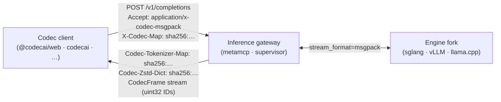
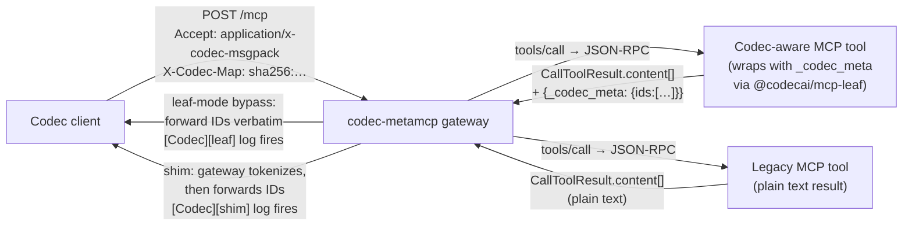
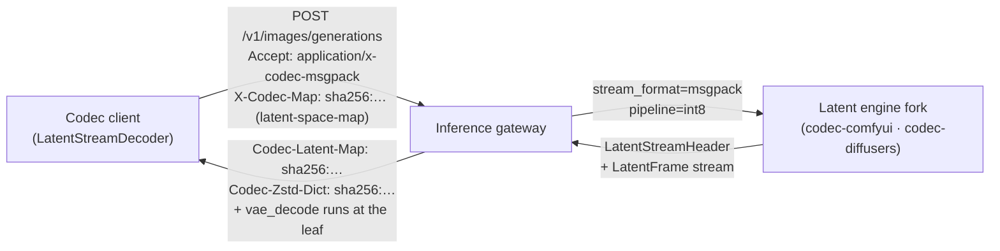

# Codec Protocol Specification: v0.3

> **This is a per-version snapshot.** The wire-format text below is
> the spec as it stood at v0.3: frozen. The "Open questions"
> sections at the bottom are **living**: items get marked
> `**Resolved.**` (with strikethrough on the original question) as
> later versions close them. The current spec lives at
> [`spec/PROTOCOL.md`](../PROTOCOL.md) (a navigation index pointing
> at the latest version). For v0.3 wire compatibility this document
> is normative; later versions are additive (per the
> [Versioning Policy](./v0.4.md#versioning-policy) codified in v0.4).

Codec is a binary transport protocol for AI inference APIs. It replaces the
UTF-8 / JSON wire format with a stream of the model's **native units**,
deferring rendering to the presentation layer: and skipping it entirely
when the caller is another model. v0.2 covered text generation (token IDs);
v0.3 adds image and video generation (VAE latents) on the same negotiation
fabric.

---

## Motivation

Current AI APIs convert model-internal token IDs to UTF-8, wrap them in JSON,
and ship them over HTTP. The model emits a ~17-bit integer; the wire carries
~150 to 190 bytes per token (measured: 154 B/token in synthetic JSON-SSE,
186 B/token from a live Ollama stream). For agent-to-agent calls the receiving
model immediately re-tokenises the text back into IDs. The round-trip through
UTF-8 serves nobody.

Codec separates the layers:

| Layer        | Job                          | Format             |
|--------------|------------------------------|--------------------|
| Model        | Produce token IDs            | uint32 IDs (native)|
| Transport    | Move IDs across the wire     | Binary frames      |
| Presentation | Decode IDs for human readers | UTF-8 text (lazy)  |

The presentation layer is invoked only when a human is actually going to read
the output. Agent-to-agent traffic skips it entirely.

---

## Modalities (v0.3)

The same layer cake holds for image and video generation. The "model's
native unit" is just different bytes:

| Modality          | Native unit                | Wire frame type        | Presentation step       |
|-------------------|----------------------------|------------------------|-------------------------|
| `text-tokens`     | uint32 token IDs           | `CodecFrame`           | detokenize → UTF-8      |
| `image-latents`   | latent tensor              | `LatentFrame` (+header)| `vae_decode` → RGB      |
| `video-latents`   | latent tensor stream       | `LatentFrame` (+delta) | `vae_decode` per frame  |

The wire mode (msgpack vs protobuf), compression negotiation, content-addressed
discovery, and `.well-known` publishing convention are **shared across
modalities**. Only the per-frame schema and the per-modality map differ:

- Text streams reference a **tokenizer map** (`spec/tokenizer-map.schema.json`).
- Latent streams reference a **latent-space map** (`spec/latent-space-map.schema.json`).
  That map carries the latent shape/dtype, a runtime-portable decoder reference
  (ONNX / ggml / safetensors / WGSL), and a list of supported transform
  pipelines (raw / int8 / delta+int8 / ...).

A connection negotiates exactly one modality at `HELLO`. Multi-modality
multiplexing within a single connection is out of scope for v0.3 and tracked
under Open Questions.

**Why latents and not pixels.** A 512×512 RGB frame at fp16 is ~1.5 MB; the
SD-1 latent that produced it is 4×64×64 fp16 = 32 KB: a 48× reduction
*before* compression. The decoder is also a learned function the client can
run once and reuse across frames. For agent-to-agent calls (e.g. a planner
asking a vision model to inspect a generation), the receiving model often
ingests latents directly and never needs the pixels at all: the same UTF-8
round-trip elimination that motivates v0.2, applied to image bytes.

### Negotiation pathways at a glance

The same client/gateway/engine triangle handles all three modalities;
only the wire frame, the per-modality map, and the response headers
differ. The diagrams below show what's on the wire for each pathway: the polished SVG twin lives at [/protocol-map](https://codecai.net/protocol-map)
on the website.

#### Text-tokens (v0.2)



#### MCP tool-calls (leaf-mode bypass)



#### Latents (v0.3)



---

## Implementations

### Servers

- **vLLM**: [vllm-project/vllm PR #41765](https://github.com/vllm-project/vllm/pull/41765).
  Adds `stream_format: "msgpack" | "protobuf"` to `/v1/completions` plus a
  bidirectional `/v1/completions/codec` endpoint. Encoder in
  `vllm/entrypoints/codec_frame.py`; transport compression in
  `vllm/entrypoints/codec_compression.py`.

- **SGLang**: [sgl-project/sglang PR #24483](https://github.com/sgl-project/sglang/pull/24483).
  Same surface area, mirrored into SGLang's serving layer. Encoder in
  `python/sglang/srt/entrypoints/codec_frame.py`; transport compression in
  `codec_compression.py`.

### Clients

Polyglot: same dialect maps work everywhere, all verified bit-identical
against HuggingFace's reference tokenizer for Qwen-2.

- **`@codecai/web`** ([npm](https://www.npmjs.com/package/@codecai/web)): isomorphic tokenizer + detokenizer for browsers, Node 18+, Cloudflare
  Workers, Deno, Bun. Pure-JS BPE encoder; ToolWatcher; Translator;
  pretok-program runtime.
- **`codecai`** ([PyPI](https://pypi.org/project/codecai/)): Python twin.
  BPE + ToolWatcher + Translator. Async stream decoders for `httpx`.
- **`Codec.Net`** ([NuGet](https://www.nuget.org/packages/Codec.Net)): .NET (net8.0). Same surface; `IAsyncEnumerable<CodecFrame>` stream
  decoders.
- **`libcodec`** ([packages/c](../../packages/c)): C99, zero deps. Ships via
  vcpkg and CMake `FetchContent`. Detokenizer + ToolWatcher today; BPE
  + Translator land alongside the v2.1 pretok-program runtime port.

- **`@codecai/maps-cli`** ([npm](https://www.npmjs.com/package/@codecai/maps-cli)): CLI for generating Codec tokenizer dialect maps from any HuggingFace
  `tokenizer.json`. The "tsc --declaration" for token vocabularies.
  Also exposes `translate` / `translation-table` subcommands for
  cross-vocab analysis.

### Map registry

- **`codec-maps`** ([github.com/wdunn001/codec-maps](https://github.com/wdunn001/codec-maps)): community registry of pre-generated maps for 14 model families covering
  70+ aliases (Llama-3, Qwen-2, Mistral, Mixtral, Gemma, Phi-3/4,
  DeepSeek-V3, Falcon, SmolLM2, Codestral). Served via jsDelivr CDN.

---

## Wire Formats

Codec defines two wire modes. Both carry identical frame semantics; they
differ only in serialization.

The frame types below (`CodecFrame`) carry text-tokens. The latent
modalities use `LatentStreamHeader` + `LatentFrame` over the same two
wire modes: see [§ Latent Modality](#latent-modality-v03) below.

### Mode A: MessagePack (`application/x-msgpack`)

Each frame is a MessagePack-encoded map:

```
{ "ids": [uint32, ...], "done": bool, "finish_reason"?: str }
```

Frames are emitted sequentially in the HTTP response body with no delimiter.
The receiver decodes using a streaming MessagePack unpacker (e.g.
`decodeMultiStream` in `@msgpack/msgpack`, `msgspec.msgpack.Decoder` in
Python).

**Bytes per token (synthetic, 1 token/chunk):** ~16 for msgpack, ~10.9 for
protobuf, vs ~154 for JSON-SSE: a 10 to 14× wire reduction before compression.
With 8-token chunks both Codec modes drop to ~4 to 5 B/token, near the raw
uint32 floor. See *Wire impact (measured)* below for the full table including
gzip/zstd overlay.

### Mode B: Protobuf (`application/x-protobuf`)

Each frame is a 4-byte big-endian length prefix followed by the raw protobuf
bytes for `CodecFrame`:

```
┌─────────────────────┬─────────────────────────┐
│  4 bytes (uint32BE) │       N bytes           │
│    frame length     │  protobuf CodecFrame    │
└─────────────────────┴─────────────────────────┘
```

Schema (also fetchable from `/codec/schema` on any Codec-enabled server):

```protobuf
syntax = "proto3";

message CodecFrame {
  repeated uint32 ids           = 1 [packed = true];
  bool            done          = 2;
  optional string finish_reason = 3;
}

message CodecRequest {
  repeated uint32 prompt_ids    = 1 [packed = true];
  uint32          max_tokens    = 2;
  float           temperature   = 3;
  repeated string stop          = 4;
  string          stream_format = 5;  // "msgpack" or "protobuf"
}
```

### Frame Semantics (both modes)

| Field           | Type          | Rules                                                    |
|-----------------|---------------|----------------------------------------------------------|
| `ids`           | uint32[]      | Raw model token IDs for this chunk. Empty only on the terminal frame when `done=true` and no final token was produced. |
| `done`          | bool          | `true` on the last frame. No further frames follow.      |
| `finish_reason` | string (opt.) | Set when `done=true`. Values: `"length"`, `"eos_token"`, `"stop_sequence"`, `"error"`. |

`finish_reason: "error"` is emitted on the terminal frame when the server
encountered an error mid-generation. Clients use this to distinguish a
genuine error from a clean stream truncation.

---

## Endpoints

### Unidirectional (text prompt → binary token stream)

```
POST /v1/completions
Content-Type: application/json
Accept-Encoding: zstd, gzip   ← optional, see Transport Compression below

{
  "model": "...",
  "prompt": "Explain entropy.",
  "stream_format": "msgpack",
  "max_tokens": 256
}

→ 200 OK
   Content-Type: application/x-msgpack
   Content-Encoding: zstd       ← only if negotiated

   <msgpack frame> {ids:[1234,5678], done:false}
   <msgpack frame> {ids:[9012],      done:false}
   <msgpack frame> {ids:[3456],      done:true,  finish_reason:"eos_token"}
```

`stream_format` accepts `"msgpack"` or `"protobuf"`. Setting it forces
`detokenize=false` server-side: no text is produced at any point.

Servers MUST reject `n > 1` for binary `stream_format` because `CodecFrame`
carries no choice index: multiple sequences would be undemultiplexable.

### Bidirectional (token IDs in → token IDs out)

There are two equivalent ways to express "no text on the wire in either
direction." Pick whichever fits your client.

**Path A: `/v1/completions` with `prompt: int[]`.** OpenAI's `prompt`
field already accepts `int[]`. No new endpoint is required. Best for
typical prompts (<10K tokens) where the JSON `[1,2,3,...]` array is fine.

```
POST /v1/completions
Content-Type: application/json
Accept-Encoding: zstd, gzip
Content-Encoding: gzip            ← optional request-body compression

{
  "model": "...",
  "prompt": [1, 2, 3, 4567, ...],
  "stream_format": "msgpack",
  "max_tokens": 256
}

→ 200 OK
   Content-Type: application/x-msgpack
   Content-Encoding: zstd

   <msgpack frame> {ids:[8901], done:false}
   ...
   <msgpack frame> {ids:[3456], done:true, finish_reason:"length"}
```

**Path B: `/v1/completions/codec` with binary request body.** Same wire
output. The request body itself is msgpack/protobuf.
This saves 2 to 3× bandwidth for very large prompts where a JSON
`[int, int, ...]` array balloons relative to the equivalent packed varint
encoding. Recommended for >50K-token contexts (e.g. RAG with long
documents). Also useful for proxies/observers that want the binary
contract explicit in the routing table itself, rather than left to be
inferred from `Content-Type` of the response.

```
POST /v1/completions/codec
Content-Type: application/x-msgpack       ← or application/x-protobuf
Accept-Encoding: zstd, gzip

<msgpack> {prompt_ids:[1,2,3,...], max_tokens:256, stream_format:"msgpack"}

→ 200 OK
   Content-Type: application/x-msgpack
   Content-Encoding: zstd

   <msgpack frame> {ids:[8901], done:false}
   ...
```

Both paths produce identical streaming output and identical "zero text on
the wire" guarantees. Servers MUST implement Path A (it's just OpenAI's
existing `prompt: int[]` plus `stream_format`). Servers SHOULD implement
Path B for the bandwidth case but MAY omit it; clients should fall back to
Path A if a `/v1/completions/codec` request returns 404.

### Schema endpoint

```
GET /codec/schema
→ 200 OK   Content-Type: text/plain

syntax = "proto3";
message CodecFrame { ... }
message CodecRequest { ... }
```

---

## Transport Compression (Optional)

Codec supports optional compression of the streaming response body using
standard HTTP `Accept-Encoding` / `Content-Encoding` negotiation. Compression
is **opt-in** (PKCE-style): the client advertises supported encodings; the
server picks one if any overlap exists, or returns identity-encoded frames if
not. Implementations on either side that don't support compression are
unaffected.

### Negotiation

```
Client request:
  Accept-Encoding: zstd, br, gzip

Server response (preference order: zstd > br > gzip > identity):
  Content-Encoding: zstd       ← if zstd supported on both sides
  Vary: Accept-Encoding
```

### Required vs optional support

| Encoding   | Server | Client | Notes                                          |
|------------|--------|--------|------------------------------------------------|
| `identity` | MUST   | MUST   | The fallback. Always works.                    |
| `gzip`     | SHOULD | SHOULD | Stdlib in every language. Universal browser support. |
| `br`       | SHOULD | SHOULD | Brotli. Universal browser support (Chrome 50+, Firefox 44+, Safari 11+, Edge 79+). Slightly better ratio than gzip on Codec streams (measured: 2.79 vs 3.47 B/token for msgpack). |
| `zstd`     | MAY    | MAY    | Best ratio + speed for non-streaming. Browsers: Chrome 123+, Firefox 126+. |

Browsers handle `Content-Encoding` decompression transparently in `fetch()`.
`@codecai/web` and other browser clients need no extra code to consume
compressed streams as a result.

### Why compression applies at the HTTP stream level

A single compression context spans the whole response stream. The
compressor builds a dictionary from earlier frames to compress later ones
better this way. Per-frame compression discards this benefit and adds 10 to 20 bytes of
header overhead per frame. That overhead dominates for small frames.

For the same reason, compression has **no minimum-size threshold**. The
streaming nature means total size isn't known upfront; gzip/zstd overhead
(~20 bytes) is negligible against typical Codec stream sizes (hundreds of
bytes minimum); and token IDs are uniformly distributed integers. Compression
always achieves some gain as a result.

### Wire impact (measured)

These are real numbers from `packages/bench`. The baselines change with
chunk size: LLM streams that emit a single token per chunk pay more
framing overhead, while batched chunks amortize it.

**1 token per chunk** (worst case for framing: typical for token-by-token streaming):

| Configuration              | Bytes/token | vs JSON-SSE |
|----------------------------|------------:|------------:|
| JSON-SSE (identity)        |       154.0 |        1.0× |
| Codec msgpack (identity)   |        16.0 |        9.6× |
| Codec protobuf (identity)  |        10.9 |       14.2× |
| Codec msgpack + `gzip`     |         3.5 |       44.4× |
| Codec msgpack + `br`       |    **2.79** |   **55.2×** |
| Codec msgpack + `zstd`     |         3.4 |       44.9× |
| Codec protobuf + `gzip`    |         3.4 |       45.1× |
| Codec protobuf + `br`      |         3.4 |       45.5× |
| Codec protobuf + `zstd`    |         3.6 |       43.1× |
| (theoretical floor: raw uint32) | 4.0    |       38.5× |

**Brotli wins on msgpack streams** because Brotli's static dictionary
captures structural patterns even in numeric data. On protobuf streams
the three compressors converge: there's not much structural redundancy
left to crush at that point.

**8 tokens per chunk** (batched output: closer to peak streaming throughput):

| Configuration                | Bytes/token | vs JSON-SSE |
|------------------------------|-------------|-------------|
| JSON-SSE (identity)          |        22.8 |        1.0× |
| Codec msgpack (identity)     |         5.5 |        4.2× |
| Codec protobuf (identity)    |         3.9 |        5.9× |

**Live measurement (Ollama qwen2.5, 320-token completion):**

| Encoder                   | Wire bytes | Bytes/token |
|---------------------------|------------|-------------|
| JSON-SSE (measured)       |   58.3 KB  |       186.4 |
| Codec msgpack (projected) |    4.7 KB  |        15.1 |
| Codec protobuf (projected)|    3.4 KB  |        11.0 |

The live JSON-SSE baseline is ~186 B/token because real model output
contains the detokenized text strings. Those strings are larger than the
synthetic placeholder text the microbench uses (154 B/token there). The
gap with Codec is bigger in the wild.

Notes:

- **Compression's biggest win is at small chunk sizes.** With 1-token
  chunks, gzip/zstd brings Codec from 11 to 16 B/token down to ~3.4 B/token: near the 4-byte raw uint32 floor. With 8-token chunks the uncompressed
  numbers (~4 to 5 B/token) already approach that floor. Compression
  saves less as a result.
- **gzip and zstd are within noise of each other on Codec streams.** The
  Codec wire formats have low structural redundancy (varint-packed
  uint32s, short field tags) so the compressor can't find much to
  exploit. Both bring you to ~3.4 B/token. zstd's bigger ratio shows up
  when there's structural redundancy to crush, as with JSON-SSE. Zstd
  flattens JSON-SSE to <1 B/token in synthetic streams (this is misleading: real
  JSON-SSE contains detokenized text which doesn't compress as well).
- **Pre-trained ZSTD dictionaries push Codec further.** Training a
  dictionary on typical token sequences for a model captures bigrams,
  instruction templates, and code structure before the first byte. See
  the next section.

### Pre-trained ZSTD dictionaries

Tokenizer maps MAY declare one or more pre-trained ZSTD dictionaries
alongside the map data. Each entry is keyed by Codec wire format
(`msgpack` or `protobuf`): the two formats train against different byte
distributions. Dicts are not interchangeable across formats as a result.

```json
{
  "id": "qwen/qwen2",
  "vocab": {...},
  "merges": [...],
  "zstd_dictionaries": [
    {
      "format": "msgpack",
      "url":    "https://raw.githubusercontent.com/wdunn001/Codec/main/dictionaries/qwen2.5-msgpack-v1.dict",
      "hash":   "sha256:...",
      "size_bytes": 16384
    },
    {
      "format": "protobuf",
      "url":    "https://raw.githubusercontent.com/wdunn001/Codec/main/dictionaries/qwen2.5-protobuf-v1.dict",
      "hash":   "sha256:...",
      "size_bytes": 16384
    }
  ]
}
```

A server that supports `Content-Encoding: zstd` and has a dict whose
`format` matches the response `stream_format` SHOULD load that dict into
the encoder for the whole stream. A client that decompresses zstd
responses MUST load the same dict (matched by hash) for that
(`tokenizer_id`, `format`) pair before reading.

**The dict is the precondition for using zstd at all**: not an
optimization on top. A server MUST NOT respond with `Content-Encoding:
zstd` unless it has loaded a matching dictionary. Without the dict:

- Wire-byte advantage over gzip is essentially zero on Codec streams
  (RESULTS.md §1f: gzip and no-dict zstd both reach ~3.4 B/token, within
  noise of each other).
- TTFB on shipped buffered middleware is catastrophic (RESULTS.md §1d:
  334× regression at 2K tokens, 11 ms → 3,684 ms).

So no-dict zstd is the worst of both worlds. The picker
(`packages/wire-compress`) enforces this with two gates: `zstdHasDict`
(per request, set by the server when its loaded tokenizer map has a
matching `zstd_dictionaries[]` entry) and `zstdEnabled` (operator's
attestation that the middleware streams rather than buffers). Both
must be true for zstd to be selected; otherwise the picker falls through
to gzip. Servers without dicts therefore stay on gzip; servers with
dicts unlock zstd's 16 to 38% extra wire savings (RESULTS.md §1g) at
+0.13 ms streaming-TTFB.

Dicts are content-addressed by sha256: a new training run publishes a
new entry with a new hash. Implementations MUST verify the hash on
fetch and SHOULD cache by hash indefinitely.

#### `Codec-Zstd-Dict` response header

When a server responds with `Content-Encoding: zstd`, it MUST emit the
hash of the dictionary it used as a `Codec-Zstd-Dict` header:

```
Content-Encoding: zstd
Codec-Zstd-Dict:  sha256:79b707aea8c2b41c2883ec7913b0c4a0c880044ac844d89a9a03e779eb92db04
Vary:             Accept-Encoding
```

The header value is `sha256:` followed by the lowercase hex digest of
the raw dictionary bytes: same shape as the `hash` field in
`zstd_dictionaries[]` entries. Without this header a client only knows
"the response is zstd-compressed"; with it, the client knows which dict
to apply for decompression and can fail fast if it doesn't have a copy
loaded.

**Client behaviour**:

- A client that receives `Content-Encoding: zstd` MUST check the
  `Codec-Zstd-Dict` header and verify the hash matches a dictionary it
  has loaded. If the dict isn't loaded locally the client SHOULD fetch
  it (using the URL from the tokenizer map's `zstd_dictionaries[]`
  entry whose `hash` matches), validate the hash, and cache.
- A hash mismatch (server's header doesn't match the dict the client
  fetched from the map) is a fatal stream error: the client MUST NOT
  attempt decompression with a different dict. Wrong-dict decompression
  produces garbage bytes that downstream parsers will misinterpret.
- A `Codec-Zstd-Dict` header on a non-zstd response (or a missing
  header on a zstd response) is a server protocol error and the client
  SHOULD treat it as such.

**Why a new header rather than inferring from `tokenizer_id`**: a single
tokenizer can have multiple dict versions over time (re-trained on
fresher corpora, or specialised per workload: code-heavy vs.
chat-heavy). The header lets a server upgrade its dict without coordinating
a tokenizer-map version bump. It also lets a single deployment serve
multiple dicts to clients that have loaded different versions. It also
makes intermediaries (proxies, observability tools) able to identify
the active dict by reading headers alone.

**Backward compatibility**: pre-header servers omit the header. A
client receiving zstd without the header SHOULD treat it as if the
header named the canonical dict for the negotiated `(tokenizer_id,
stream_format)` per the tokenizer map: the original implicit contract.
New clients MAY refuse to decompress in this case and surface the
missing header as an error; this is a deployment-time decision.

Reference training pipeline lives in
`packages/bench/scripts/train-zstd-dict.py`; reference shipped
dictionaries live in `dictionaries/`. Measured gain over no-dict zstd:
see `packages/bench/RESULTS.md` §1g.

---

## Tokenizer Map

The tokenizer map is a JSON document conforming to
[`tokenizer-map.schema.json`](../tokenizer-map.schema.json). It carries the
data needed to:

- **Decode** token IDs back to text (presentation layer, browser side).
- **Encode** text into token IDs (when the client does its own
  tokenization: required for the bidirectional endpoint with text input).

### Schema summary (v2.1)

```json
{
  "id": "meta-llama/llama-3",
  "version": "2",
  "vocab_size": 128256,

  "vocab":   { "Hello": 9906, "Ġworld": 1917, ... },
  "encoder": "byte_level",
  "merges":  ["Ġ Ġ", "Ġ t", "i n", ...],

  "pre_tokenizer_pattern": "(?i:'s|'t|...)| ?\\p{L}+|...",
  "pre_tokenizer_program": {
    "version": 1,
    "ops": [
      { "op": "literals_ci", "patterns": ["'s","'t","'re","'ve","'m","'ll","'d"] },
      { "op": "letters",     "lead_other": true },
      { "op": "numbers",     "max_run": 3 },
      { "op": "punct_run",   "lead_space": true, "trailing_newlines": true },
      { "op": "newline_block" },
      { "op": "trailing_ws" },
      { "op": "ws_run" }
    ]
  },

  "byte_fallback_start": 3,
  "byte_fallback_end":   258,

  "special_tokens": { "<|begin_of_text|>": 128000, ... },
  "published_at":   "2026-05-06T00:00:00Z"
}
```

`pre_tokenizer_pattern` (v2) and `pre_tokenizer_program` (v2.1, additive)
are functionally equivalent: the program is the regex compiled into a
named-op list. Runtimes prefer the program when present; old clients
continue to use the pattern. The program form exists so runtimes
without a Unicode regex engine (libcodec/C, embedded targets) can
still encode without dragging in PCRE2 or hand-rolling `\p{L}`. See
[`PRETOKENIZER_PROGRAM.md`](../PRETOKENIZER_PROGRAM.md) for the op set
and equivalence rules.

### Encoder families

Three tokenizer families cover ~95% of open models:

| `encoder`   | Vocab key form    | Byte fallback | Examples                         |
|-------------|-------------------|---------------|----------------------------------|
| `byte_level`| `Ġhello`          | implicit (every byte is in vocab) | Llama-3, Qwen-2, Phi-3/4, DeepSeek-V3, Mistral-Nemo, Falcon, SmolLM2 |
| `metaspace` | `▁hello`          | `<0x00>`:`<0xFF>` range | Llama-2, Mistral-v3, Mixtral, Gemma, Codestral |
| omitted     | `hello` (decoded) | optional      | Synthetic / canonical-IR / closed vocabs |

### Encode path

For `byte_level`:
1. Apply `pre_tokenizer_pattern` regex to split text into pieces.
2. UTF-8-encode each piece, then map every byte through the GPT-2
   byte→unicode table to produce the vocab character space.
3. Apply BPE merges greedily by priority.
4. Look up resulting tokens in `vocab`.

For `metaspace`:
1. Split text on whitespace; prefix each word with `▁`.
2. Apply BPE merges greedily by priority.
3. Look up resulting tokens in `vocab`. Tokens not in vocab fall back to
   their UTF-8 bytes via `byte_fallback_start`.

### Decode path

For `byte_level`: each vocab token is a string of GPT-2-encoded bytes.
Reverse the byte table per character to get raw bytes; accumulate across
tokens; UTF-8-decode complete sequences.

For `metaspace`: replace `▁` with space and append. IDs in
`[byte_fallback_start, byte_fallback_end]` are decoded as raw bytes and
buffered for UTF-8 reassembly.

For both: partial multi-byte sequences MUST be buffered across frame
boundaries: a frame boundary is never a valid rendering boundary for a
partial emoji or multi-byte character.

### Content addressing and caching

Maps are content-addressed by sha256 hash. Clients call
`loadMap({ url, hash })` and the loader rejects any payload whose hash
doesn't match: making the URL itself untrusted; the hash is the trust
anchor. Cached by `(url, hash)`; cache hits skip the network entirely.

A new model version publishes a new map at a new URL with a new hash. Maps
are immutable once published.

### Map discovery

Clients learn `map_url` and `map_hash` from one of:

1. **Direct configuration**: the application code passes them to `loadMap`.
   Simplest case, used for fixed-model deployments.

2. **`.well-known/codec/` convention**: model maintainers self-host a
   pointer (or the map itself) at a fixed location on a domain they
   control:

   ```
   GET https://<origin>/.well-known/codec/maps/<id>.json
   ```

   The document is either an inline `TokenizerMap` (Form B) or a small
   pointer `{ id, url, hash }` (Form A) that references the actual map on
   any CDN. Clients pass `(origin, id)` to `discoverMap` and the loader
   resolves the rest. Maintainers may also publish
   `.well-known/codec/index.json` listing every map they expose. Full
   spec: [`WELL_KNOWN_DISCOVERY.md`](../WELL_KNOWN_DISCOVERY.md).

3. **Future: `READY` frame**: when the full session protocol is
   implemented, the server's `READY` response carries `map_url` and
   `map_hash` for the negotiated tokenizer. Same data; different transport.

4. **Future: registry lookup**: `GET registry.codec.ai/v1/maps/<model-id>`
   returns `{ url, hash }`. Enables cross-org discovery and air-gapped
   substitution. Coexists with the `.well-known` convention; the registry
   is centralised lookup, the convention is decentralised publishing.

---

## Cross-vendor tokenizer handling

Different vendors publish different tokenizer vocabularies. They do not need
to be unified: only the **contract** for declaring and fetching them does.

The pattern is identical to HTTP `Content-Type: charset=`:

- The encoding stays vendor-specific.
- The declaration mechanism is standardised.
- Clients load whichever map the server declares.

A client talking to three vendors loads three maps, the same way a media
player loads three codecs. Maps are cached after first fetch, versioned with
the model, and updated when the model updates.

### Cross-vocab agent handoffs

When Agent A (vocab V₁) passes tokens to Agent B (vocab V₂), Codec keeps
text off the wire even though tokenization isn't shared:

1. **Wire stays binary in both directions.** A's output frames flow over
   Codec; B's input prompt is encoded by the orchestrator and submitted
   as `prompt: int[]` (or via the binary endpoint). No JSON-text round
   trip on the network.
2. **The translation step is local.** The orchestrator runs a
   `Translator` that pipes `ids_A → Detokenizer(V₁) → text → Tokenizer(V₂) → ids_B`
   in-process. The text is never serialized to a wire format; it's a
   transient buffer.
3. **Streaming-safe.** The Translator buffers partial words at
   whitespace boundaries so chunks streamed mid-merge re-tokenize the
   same way as the complete word would.
4. **Deterministic + cacheable.** For a fixed (V₁, V₂) pair, the
   per-token mapping table is deterministic. Clients can also build a
   context-free `staticTranslationTable(V₁, V₂)` lookup for analysis
   (vocab overlap, cost estimation): though context-dependent BPE
   merges mean the streaming Translator is what production uses.

When V₁ = V₂ (same vendor, same model version), no translation is
needed: frames pass through verbatim.

`Translator` ships in `@codecai/web`, `codecai`, and `Codec.Net`. The C
client is pending the v2.1 pretok-program runtime; today, C consumers
that need cross-vocab handoff IPC to one of the other implementations.

### Tool-call detection without decoding

Most chat-tuned models delimit tool calls (and reasoning blocks, vision
spans, sandbox regions, channel headers) with **single-token specials**
that travel on the wire as plain uint32 IDs. The orchestrator can
detect those boundaries by ID compare alone: no detokenize, no string
allocation, no vocab read.

| Model family | Markers (start / end) |
|--------------|------------------------|
| Llama 3.1+   | `<\|python_tag\|>` / `<\|eom_id\|>` |
| Qwen 2.5+    | `<tool_call>` / `</tool_call>` |
| Phi-4        | `<\|tool\|>` / `<\|/tool\|>` |
| Mistral-Nemo | `[TOOL_CALLS]` / `[/TOOL_CALLS]` |
| DeepSeek-V3  | `<｜tool▁calls▁begin｜>` / `<｜tool▁calls▁end｜>` |
| DeepSeek-R1  | `<think>` / `</think>` (reasoning blocks; same primitive) |

Every Codec client ships a `ToolWatcher` that resolves the start/end
names to IDs once via `special_tokens` and runs an O(n) state machine
over the wire stream. Microbench: ~100× faster than running the
detokenizer over the same IDs (see `packages/c/examples/bench_watcher.c`).

The watcher is **protocol-adjacent** rather than protocol-mandated: the wire
format already exposes raw IDs. Any client can re-implement the
detection on top of that. We ship it in every client because every orchestrator needs
it and the implementation is identical across languages.

### Tool-call calling conventions in the map

Detection (above) is the easy half: the markers travel as plain IDs.
The hard half is the **calling convention**: how the model expects a
tool call to be packaged inside those markers (Llama 3.1 wraps a JSON
object after `<|python_tag|>`; Qwen 2.5 wraps a JSON object inside
`<tool_call>...</tool_call>`; Mistral-Nemo wraps a list of objects
inside `[TOOL_CALLS]...[/TOOL_CALLS]`; etc.) and how it expects results
to come back.

That convention is **per-model data**: it's encoded in the model's
chat template, the same Jinja string HuggingFace ships in
`tokenizer_config.json` next to the vocabulary. The convention belongs
in the existing tokenizer map, distributed by the same content-
addressed `.well-known` / jsDelivr fabric as the vocab itself. Adding
it as a first-class manifest field eliminates the out-of-band coupling
where every consumer has to re-derive it from the spec table above.

The map carries an optional `tool_calling` block (see
`spec/tokenizer-map.schema.json`):

```json
"tool_calling": {
  "convention": "llama3" | "qwen25" | "phi4" | "mistral_nemo" |
                "deepseek_v3" | "deepseek_r1" | "custom",
  "markers": {
    "start": "<|python_tag|>",
    "end":   "<|eom_id|>"
  },
  "args_format":   "json" | "python_args",
  "result_format": "text" | "json"
}
```

The `markers` strings MUST appear as keys in the map's `special_tokens`
object: the values they resolve to are the IDs ToolWatcher compares
against. `convention` names a normative entry in a registry that
governs how arguments and results are packed inside the marker pair;
`custom` opts out of the registry and pins the layout in
implementer-supplied prose.

`@codecai/maps-cli` populates this block when it sees a known chat
template signature in `tokenizer_config.json`. Maps generated before
the block existed simply omit it: readers MUST treat absence as
"convention not declared; behave per the prose table above" rather
than as an error.

#### Leaf-tokenization is the architectural target

A Codec-aware MCP server reads the `tool_calling` block from the
session's negotiated map and tokenizes its result accordingly,
emitting token IDs in the existing `_codec_meta` content-block shape
(see codec-content.ts in any Codec-aware gateway implementation).
Engine, gateway, and agent operate on the IDs end-to-end; UTF-8 lives
only inside the leaf tool's own logic. **No new wire frame types are
introduced for tool calls**: the payload is uint32 token IDs, same
as completions. `CodecFrame` carries them just the same.

Tools that don't yet speak Codec stay on JSON-RPC. The gateway falls
back to a **gateway-tokenize shim** that does the leaf's work on the
tool's behalf: observable to operators, named explicitly as a back-
compat path, and meant to disappear from any given session as MCP
servers upgrade. Reference implementation:
`apps/backend/src/lib/metamcp/codec/codec-content.ts` in
`wdunn001/metamcp`.

#### `Codec-Tokenizer-Map` response header

When a Codec-aware tool returns ID-tokenized result content, it
SHOULD emit a `Codec-Tokenizer-Map` response header naming the
tokenizer map it tokenized against:

```
Codec-Tokenizer-Map: sha256:79b707aea8c2b41c2883ec7913b0c4a0c880044ac844d89a9a03e779eb92db04
```

Symmetric to `Codec-Latent-Map` for v0.3 latents. A client receiving
this header MUST verify the hash matches a tokenizer map it has
loaded (the same map the request's `X-Codec-Map` pinned) and fail
fast on mismatch. Mismatch produces wrong KV-cache state on the
engine side and is a fatal session error.

---

## Latent Modality (v0.3)

Image and video generation models emit **latent tensors** rather than token IDs.
A latent is a low-dimensional learned representation that a paired VAE
decoder transforms back into pixels. Codec ships latents on the wire and
defers `vae_decode` to the presentation layer: the same architectural
move v0.2 makes for tokens.

### Latent frames

A latent stream begins with **one** `LatentStreamHeader` carrying the
shape, dtype, latent-space identifier, and pipeline (transform) used to
produce subsequent frames. Every frame after the header is a
`LatentFrame`. Receivers MUST treat the first frame in a latent stream
as the header.

#### `LatentStreamHeader`

```protobuf
message LatentStreamHeader {
  string latent_space_id = 1;   // e.g. "stabilityai/sd-vae-ft-mse"
  repeated uint32 shape  = 2;   // per-frame latent shape, e.g. [4, 64, 64]
  string dtype           = 3;   // "fp16" | "bf16" | "int8" | "int4"
  string pipeline        = 4;   // "raw" | "int8" | "delta+int8" | ...
  optional float scale   = 5;   // dequantization scale (when dtype != fp16/bf16)
  optional uint32 fps    = 6;   // video only; 0 or absent for image-latents
  optional uint32 total_frames = 7;  // video only; absent if unknown/streaming
  optional float vae_scale_factor  = 8;  // model's known scale (e.g. 0.18215 for SD-1)
}
```

`pipeline` names a deterministic transform applied server-side that the
client reverses before feeding bytes into the decoder. The pipeline
identifier MUST appear in the latent-space-map's `pipelines[]` list (see
`spec/latent-space-map.schema.json`). Reference vectors for each named
pipeline live in `packages/bench/golden/` and are the ground truth for
cross-implementation conformance.

#### `LatentFrame`

```protobuf
message LatentFrame {
  bytes  data            = 1;   // packed latent bytes, post-pipeline
  uint32 seq             = 2;   // monotonic frame index (0-based; image streams = 0)
  bool   keyframe        = 3;   // true = self-contained; false = delta vs prior keyframe
  bool   done            = 4;
  optional string finish_reason = 5;   // "ok" | "length" | "stop" | "error"
}
```

| Field           | Rules                                                                    |
|-----------------|--------------------------------------------------------------------------|
| `data`          | Packed bytes per the negotiated pipeline. Length = `prod(shape) × bytes_per_elem` for `pipeline="raw"`, smaller after quantization, smaller still after delta-coding. |
| `seq`           | Image-latents: always 0. Video-latents: monotonic 0,1,2,... Receivers reject out-of-order or duplicate seq. |
| `keyframe`      | Image-latents: always true. Video-latents: true on the first frame and at periodic keyframe intervals; false for delta frames. A delta frame's `data` is decoded against the most recent keyframe in this stream. |
| `done`          | True on the terminal frame. No further frames follow.                    |
| `finish_reason` | Set when `done=true`. `"error"` distinguishes a server-side failure from a clean termination. |

**Why a separate header rather than repeating shape/dtype on every
frame.** Per-frame metadata adds 30 to 60 bytes per `LatentFrame` versus
the per-stream header which adds them exactly once. For a 24 fps video
stream this is the difference between 1.4 KB/sec and 30 bytes/stream of
overhead.

### Pipelines

A pipeline is a named, deterministic byte-level transform. Every
pipeline has a forward (server-side) and inverse (client-side) form.
The round-trip is bit-exact at the latent-byte boundary. Pipelines do
not touch the decoder; they only restructure latent bytes for transport.

The full registry, with normative forward/inverse math, lives in
[`spec/PIPELINES.md`](../PIPELINES.md). The table below is an informative
digest:

| Pipeline          | Forward                                                                       | Wins                                                  |
|-------------------|-------------------------------------------------------------------------------|-------------------------------------------------------|
| `raw`             | Pack tensor in row-major order.                                               | Bit-exact, no model contract assumptions.             |
| `int8`            | Per-channel symmetric quantization to int8; scales travel in the header.      | 2× over fp16; minimal SSIM loss at typical SD scales. |
| `int4`            | Per-channel symmetric quantization to int4 (packed 2-per-byte).               | 4× over fp16; lossy enough to require quality gating. |
| `int8-adaptive`   | int8 with per-keyframe scales prepended to frame bytes.                       | 2×; preferred when latents drift across frames.       |
| `int4-adaptive`   | int4 with per-keyframe scales prepended to frame bytes.                       | 4×; same use case as `int8-adaptive`, more lossy.     |
| `delta+int8`      | Subtract prior keyframe's int8 latent; transmit residual.                     | Video only. Collapses temporally redundant bytes.     |
| `delta+int4`      | Same, with int4 residual.                                                     | Video only. Most aggressive lossy mode.               |

Implementations MUST advertise pipeline support in `accept_pipelines`
during `HELLO` and reject any header whose `pipeline` they don't know.
Adding a pipeline is a v0.3+ point release: the registry of named
pipelines is normative and closed to per-deployment extension.

### Endpoints

Latent endpoints follow the same shape as the v0.2 text endpoints,
opted in via `stream_format`:

```
POST /v1/images/generations
Content-Type: application/json
Accept-Encoding: zstd, gzip

{
  "model": "...",
  "prompt": "a wide-angle photograph of a snowy mountain at dusk",
  "stream_format": "msgpack",
  "modality":      "image-latents",
  "latent_space":  "stabilityai/sd-vae-ft-mse",
  "pipeline":      "int8",
  "size": "512x512",
  "steps": 30,
  "seed": 42
}

→ 200 OK
   Content-Type: application/x-msgpack
   Content-Encoding: zstd
   Codec-Zstd-Dict:  sha256:...
   Codec-Latent-Map: sha256:...

   <msgpack frame> LatentStreamHeader { latent_space_id, shape:[4,64,64], dtype:"int8", pipeline:"int8", ... }
   <msgpack frame> LatentFrame        { data: <... int8 bytes ...>, seq:0, keyframe:true, done:true, finish_reason:"ok" }
```

Video uses the same shape with `modality: "video-latents"`. Frames stream
as they are produced; `LatentFrame.seq` is monotonic, and `done=true`
terminates the stream:

```
POST /v1/videos/generations
{
  ...,
  "modality":     "video-latents",
  "latent_space": "stabilityai/wan-vae-2.1",
  "pipeline":     "delta+int8",
  "fps": 24,
  "duration_seconds": 5
}
```

The `Codec-Latent-Map` response header is the latent-modality analogue
of the existing `Codec-Zstd-Dict` header: it carries the sha256 of the
latent-space-map document the server produced these bytes against. A
client can fail-fast this way if it hasn't loaded a matching map.

### Compression and dictionaries

Latent streams use the same `Accept-Encoding` / `Content-Encoding`
negotiation as text streams. The trained-zstd-dict mechanism extends
unchanged in shape, but the dict is keyed by `(latent_space_id, format,
pipeline)` instead of `(tokenizer_id, format)`:

```json
"zstd_dictionaries": [
  {
    "format":    "msgpack",
    "pipeline":  "delta+int8",
    "url":       "https://.../sd-vae-ft-mse-msgpack-delta-int8-v1.dict",
    "hash":      "sha256:...",
    "size_bytes": 16384
  }
]
```

A server MUST NOT respond with `Content-Encoding: zstd` unless it has
loaded a dict whose `(format, pipeline)` matches the response. The
`Codec-Zstd-Dict` header carries the active dict's sha256 exactly as
in v0.2; the client matches it against the latent-space-map's
`zstd_dictionaries[]` to locate the bytes.

**Why pipeline-keyed dicts.** Raw fp16 latents are near-Gaussian by
construction (the VAE encoder is trained to produce a near-isotropic
prior). A dict trained on raw bytes therefore wins only ~5 to 15% over no-dict
zstd. The dict pays off only after a structural pre-pass:
quantization concentrates bytes into a small alphabet. For video,
delta-coding also collapses temporally redundant values into mostly-zero
residuals. A dict trained on the post-pipeline byte stream therefore
captures the structure the pipeline produces. It is meaningless
against any other pipeline, and mixing them is silently miscompressing.

### Discovery

Latent-space maps publish at:

```
https://<origin>/.well-known/codec/latents/<id>.json
```

Same pointer-or-inline convention, same hash-pinned trust model, same
resolution algorithm as tokenizer maps. See
[`WELL_KNOWN_DISCOVERY.md`](../WELL_KNOWN_DISCOVERY.md) for the document
shape and resolution rules.

### Validation contract

The text modality's invariant is **bit-identity** against a reference
tokenizer. The latent modality cannot make that claim across the
decoder boundary: VAE decoders are floating-point and non-deterministic
across runtimes (ONNX-Web vs torch vs ggml vs WGSL). The contract
therefore splits in two:

- **Latent-byte boundary: bit-identical.** Server-emitted bytes equal
  client-received bytes after pipeline inversion. This invariant is
  testable on every client without a decoder loaded.
- **Pixel boundary: perceptual bound.** Decoded pixels match a frozen
  reference (pinned torch + diffusers in a content-addressed Docker
  image: `packages/bench/golden/`) within published SSIM / PSNR /
  LPIPS thresholds per latent-space-map and pipeline. The threshold
  list is part of the bench methodology, kept out of the wire spec proper.

The `latents validate` subcommand on `@codecai/maps-cli` enforces both
halves on a fixture suite before a map can ship.

### Fallback to server-side decode

A client that receives a `LatentStreamHeader` for a latent-space whose
decoder it has not loaded MAY downgrade by re-issuing the request
without `modality: "image-latents"` (or `video-latents`); the server
falls back to producing rendered pixels in the standard image/video
response shape. Servers that do not support the rendered fallback
SHOULD respond `415 Unsupported Media Type` with a body listing
supported modalities. The client can then fail fast rather than silently
hang on a stream it cannot decode.

---

## Session Protocol (future)

The stateless HTTP mode covers the common case. A frame-based session
protocol is sketched below for persistent connections, multiplexed streams,
dynamic tokenizer/latent-space negotiation, and transport upgrade. Not yet
implemented.

### Frame Structure

```
┌──────────┬──────────────────────────┬──────────────────┐
│  1 byte  │         4 bytes          │     N bytes      │
│   type   │  payload_len  (uint32BE) │    payload       │
└──────────┴──────────────────────────┴──────────────────┘
```

All multi-byte integers are **big-endian**.

### Frame Types

| Value | Name             | Direction       | Description                                       |
|-------|------------------|-----------------|---------------------------------------------------|
| 0x00  | `HELLO`          | Client → Server | Session init, declares capabilities               |
| 0x01  | `READY`          | Server → Client | Confirms modality + map, optionally upgrades transport |
| 0x02  | `TOKENS`         | Server → Client | Packed token ID array (text-tokens modality)      |
| 0x03  | `EOS`            | Server → Client | End of stream, empty payload                      |
| 0x04  | `ERROR`          | Either          | UTF-8 error message                               |
| 0x05  | `LATENT_HEADER`  | Server → Client | First frame of a latent stream (v0.3)             |
| 0x06  | `LATENTS`        | Server → Client | Latent frame payload (v0.3)                       |

### Handshake

**HELLO**: client opens session and declares the full capability surface:

```json
{
  "codec_version": "0.3",

  "modalities":           ["text-tokens", "image-latents", "video-latents"],
  "accept_tokenizers":    ["meta-llama/llama-3", "qwen/qwen2"],
  "accept_latent_spaces": ["stabilityai/sd-vae-ft-mse", "stabilityai/sdxl-vae"],
  "accept_decoders":      ["onnx-web", "torch", "ggml", "wgsl"],
  "accept_pipelines":     ["raw", "int8", "delta+int8"],

  "accept_transports":    ["http", "ws", "webrtc"],
  "accept_encoding":      ["zstd", "br", "gzip"]
}
```

**Capability axes.** A v0.3 client declares what it can *terminate*, distinct from
what it wants. The server picks one of each axis. A v0.2 client omits
the latent fields entirely; servers negotiating with a v0.2 client behave
as if `modalities: ["text-tokens"]` was sent.

| Field                  | Meaning                                                                 |
|------------------------|-------------------------------------------------------------------------|
| `modalities`           | Which native units the client can decode. Server picks one.             |
| `accept_tokenizers`    | Tokenizer maps the client has loaded (or can fetch). Required when text-tokens negotiated. |
| `accept_latent_spaces` | Latent-space maps + decoders the client has loaded. Required when image-/video-latents negotiated. |
| `accept_decoders`      | Decoder runtimes the client can execute. Server picks a decoder format compatible with this list. |
| `accept_pipelines`     | Named transform pipelines the client can invert. `raw` is mandatory. Server MUST NOT pick a pipeline outside this list. |
| `accept_transports`    | Wire transports the client can run. `http` is mandatory; `ws` / `webrtc` are optional. |
| `accept_encoding`      | Compression encodings (existing v0.2 negotiation, unchanged).           |

**READY (text-tokens)**: server confirms tokenizer, provides map, stays on HTTP:

```json
{
  "codec_version": "0.3",
  "modality": "text-tokens",

  "tokenizer_id": "meta-llama/llama-3",
  "map_url":  "https://cdn.jsdelivr.net/gh/wdunn001/codec-maps/maps/meta-llama/llama-3.json",
  "map_hash": "sha256:79b707aea8c2b41c2883ec7913b0c4a0c880044ac844d89a9a03e779eb92db04",

  "transport": "http",
  "encoding":  "zstd"
}
```

**READY (image-latents)**: server confirms the latent-space map, picks pipeline + decoder:

```json
{
  "codec_version": "0.3",
  "modality": "image-latents",

  "latent_space_id":  "stabilityai/sd-vae-ft-mse",
  "latent_map_url":   "https://qwen.io/.well-known/codec/latents/stabilityai/sd-vae-ft-mse.json",
  "latent_map_hash":  "sha256:a1b2…",
  "decoder_runtime":  "onnx-web",
  "pipeline":         "int8",

  "transport": "http",
  "encoding":  "zstd"
}
```

**READY (video-latents) with WebRTC transport upgrade**: server picks the
WebRTC transport advertised in `accept_transports` and returns the upgrade
metadata. The HTTP request that produced this `READY` ends; subsequent
`LATENT_HEADER` and `LATENTS` frames flow over the WebRTC data channel:

```json
{
  "codec_version": "0.3",
  "modality": "video-latents",

  "latent_space_id":  "stabilityai/wan-vae-2.1",
  "latent_map_url":   "https://stability.ai/.well-known/codec/latents/stabilityai/wan-vae-2.1.json",
  "latent_map_hash":  "sha256:c3d4…",
  "decoder_runtime":  "ggml",
  "pipeline":         "delta+int8",

  "transport": "webrtc",
  "upgrade": {
    "sdp_offer_url": "https://server.example/codec/webrtc/offer/abc123",
    "ice_servers":   [{ "urls": "stun:stun.example.com:19302" }],
    "data_channel":  { "ordered": true, "max_retransmits": 0 }
  },

  "encoding": "zstd"
}
```

### Transport selection

| Transport | When to pick                                                                                    | Frame envelope            |
|-----------|-------------------------------------------------------------------------------------------------|---------------------------|
| `http`    | Default. Stateless request/response, no upgrade. Works for all text-token streams and image-latent streams. | Sequential msgpack/protobuf in the response body, as today. |
| `ws`      | Persistent client/server with multiple stream requests, low-overhead bidirectional control. | Each WebSocket message is one Codec frame. |
| `webrtc`  | Video-latents at interactive frame rates (≥24 fps), or any stream where jitter dominates total latency. | Each datagram is one Codec frame; ordering and partial reliability per `upgrade.data_channel`. |

A server MAY downgrade the requested transport (e.g. answer `http` to a
client that listed `webrtc`) if the upgrade isn't supported for the
negotiated modality. Clients MUST handle the downgrade silently. Servers
MUST NOT upgrade beyond what the client advertised.

---
## What this is NOT

- Not a replacement for HTTP. Codec frames are transported over HTTP/1.1,
  HTTP/2, or QUIC.
- Not a new tokenizer. Codec declares and fetches existing tokenizers; it
  does not define vocabularies.
- Not a model API. Codec is a wire-format layer beneath the existing message
  API. Text-mode APIs continue to work unchanged for clients that want
  simplicity.

---

## Migration path

Text APIs and Codec coexist the way HTTP/1.1 and HTTP/2 coexist.

```
POST /v1/completions                              ← existing JSON/SSE path (unchanged)
POST /v1/completions  + stream_format             ← opt-in binary output
POST /v1/completions  + prompt:int[] + stream_format  ← bidirectional via JSON request
POST /v1/completions/codec                        ← bidirectional via binary request (huge prompts)
GET  /codec/schema                                ← proto schema for client codegen
```

Clients that want efficiency opt in. Clients that want simplicity stay on
text. Logging and debugging tools decode token streams using the declared
map, the same way Wireshark decodes binary protocols.

---
## Open questions (v0.2)

1. ~~**Pre-trained ZSTD dictionaries.**~~ **Resolved.** Schema and
   training pipeline shipped: `zstd_dictionaries[]` on the tokenizer map,
   one entry per format (msgpack, protobuf), distributed by URL + sha256.
   Training pipeline at `packages/bench/scripts/train-zstd-dict.py`;
   reference dicts at `dictionaries/`. Measured offline gain in
   `packages/bench/RESULTS.md` §1g. Server-side enablement (loading the
   dict in sglang's `codec_compression.py` and the vLLM/llama.cpp PR
   equivalents) is the remaining piece: tracked separately.

2. **Batched / parallel streams.** Multi-stream multiplexing (HTTP/2 push
   style) within a single connection, for speculative decoding outputs.

3. ~~**Map discovery registry.**~~ **Resolved toward decentralised publishing
   first.** Maintainers self-host at `https://<origin>/.well-known/codec/maps/<id>.json`
   (pointer or inline map); clients call `discoverMap({ origin, id })`.
   See [`WELL_KNOWN_DISCOVERY.md`](../WELL_KNOWN_DISCOVERY.md). A centralised
   registry (`registry.codec.ai/v1/maps/<id>`) remains an open option for
   cross-org discovery and air-gapped substitution; the two coexist.

4. ~~**Bidirectional.**~~ **Resolved.** `POST /v1/completions/codec` accepts
   binary request bodies (`prompt_ids` as packed uint32) and streams binary
   frames in response.

5. ~~**Compression.**~~ **Resolved.** HTTP `Accept-Encoding` / `Content-Encoding`
   negotiation. Optional zstd, fallback gzip, identity always works.

6. ~~**gRPC vs raw frames.**~~ **Resolved toward HTTP + MessagePack/Protobuf.**
   The stateless HTTP mode ships today and composes with existing
   infrastructure. gRPC remains an option for the full session protocol if
   persistent connections and multiplexing become requirements.

7. ~~**Polyglot client coverage.**~~ **Resolved.** TS, Python, .NET, C ship
   on package registries today (npm, PyPI, NuGet, vcpkg + FetchContent).
   Java is queued for Maven Central.

8. ~~**Tool-call detection without decoding.**~~ **Resolved as a per-client
   primitive.** Every client ships a `ToolWatcher` that detects delimited
   regions by special-token ID compare. ~100× faster than detokenizing
   the same stream.

9. ~~**Cross-vocab agent handoff.**~~ **Resolved as a per-client primitive.**
   Every client except libcodec ships a `Translator` that pipes
   `ids_A → text → ids_B` locally with streaming-safe word-boundary
   buffering. Wire stays binary in both directions.

10. ~~**Pre-tokenizer regex dependency.**~~ **Resolved.** Maps now carry
    an optional `pre_tokenizer_program` (v2.1, additive): an op list
    that runtimes can execute without a Unicode regex engine. Unblocks
    BPE encoding in environments where pulling PCRE2 is non-trivial
    (libcodec, embedded, WASM).

---

## Open questions (v0.3)

1. **Pipeline registry governance.** v0.3 ships five pipelines (`raw`,
   `int8`, `int4`, `delta+int8`, `delta+int4`). Adding a sixth requires
   a point release because the pipeline name encodes actual math beyond mere
   serialization. Clients must invert it bit-exactly. Open questions: who
   reviews pipeline proposals? What reference test vectors does a
   new pipeline have to ship with before it lands? Default plan: a
   `packages/bench/golden/pipelines/<name>/` directory of fixtures
   (latent in, post-pipeline bytes out) and a conformance test in every
   client's bench harness.

2. **`golden/` reference container.** Cross-runtime decoder drift
   (torch vs ONNX-Web vs ggml vs WGSL) means perceptual conformance
   needs a frozen ground truth. Resolved direction (2026-05-08):
   `packages/bench/golden-builder/` ships a Dockerfile pinning torch +
   diffusers + CUDA + driver versions; the container's sha256 is the
   trust anchor referenced by every latent bench cell.

3. **Multi-stream multiplexing within a session.** v0.3 negotiates one
   modality per connection. A future revision may allow simultaneous
   token + latent streams within one `HELLO` (e.g. a multimodal model
   producing interleaved text and images), at the cost of frame-level
   stream tagging. Tracked alongside the existing v0.2 open question on
   batched/parallel streams.

4. **Decoder weight distribution.** Tokenizer maps are kilobytes; VAE
   decoders are 50 MB:GB-scale. The discovery convention pins decoder
   bytes content-addressed by sha256, but caching strategy and
   air-gapped substitution remain client-side concerns. Pre-warming via
   the `index.json` directory document is the recommended pattern; a
   future registry mirror analogous to `codec-maps` is open.

5. **Audio-latents.** Out of scope for v0.3 but architecturally
   identical (audio-codec models like Encodec / SoundStream emit
   tokens that decode to waveforms via a learned function). The
   modality slot anticipates this; pipelines and frame schema can be
   added additively in a future release.

